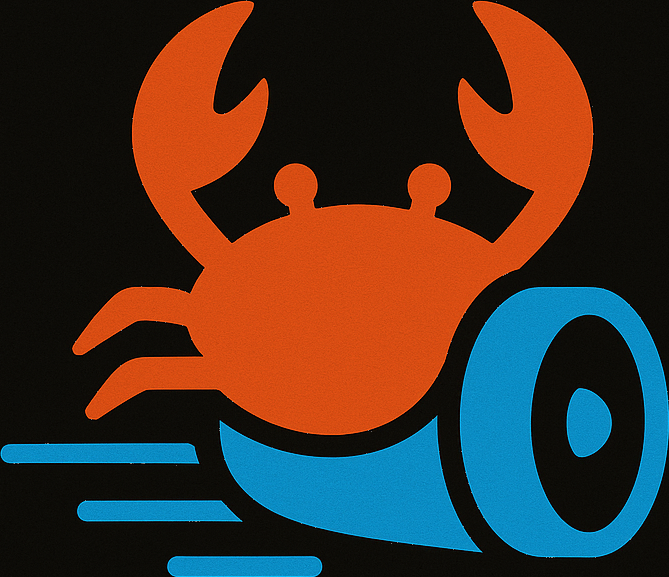

# JetCrab

<div align="center">
  
  
  <h1>JetCrab</h1>
  
  <p>JavaScript runtime for the JetCrab stack - our Node.js/Bun equivalent. Powered by the Chitin engine and Tokio for async I/O.</p>
  
  [](https://opensource.org/licenses/MIT)
  [](https://www.rust-lang.org/)
  [](https://github.com/JetCrabCollab/chitin)
  [](https://tokio.rs/)
  [](https://github.com/JetCrabCollab/jetcrab)
  [](https://codecov.io/gh/JetCrabCollab/jetcrab)
  [](https://discord.gg/jetcrab)
  [](https://github.com/JetCrabCollab/jetcrab/issues)
  [](https://github.com/JetCrabCollab/jetcrab/stargazers)
</div>

## Overview

JetCrab is the **JavaScript runtime** for the JetCrab stack - our Node.js/Bun equivalent. It provides a complete execution environment with built-in APIs for I/O, networking, and system operations.

**Stack mapping:**
- **CPM** = npm/yarn (package manager)
- **Chitin** = Bun engine (JS execution)
- **JetCrab** = Node.js/Bun (runtime)

See [ARCHITECTURE.md](../ARCHITECTURE.md) for the full ecosystem design.

## Features

### Core Runtime
- **JavaScript Execution**: Full JavaScript execution via Chitin (WASM) engine
- **Built-in APIs**: Console, Process, and Fetch APIs (host bindings)
- **Async Operations**: Tokio integration for asynchronous I/O
- **CLI Interface**: run, eval, repl, test, fmt, lint
- **Package Management**: Use CPM (Crab Package Manager) for dependencies

### Development Tools
- **Hot Reload**: Development server with automatic reloading
- **Linting**: Code quality and style checking
- **Formatting**: Automatic code formatting
- **Testing**: Built-in testing framework
- **Debugging**: Source mapping and debugging support

### Integration
- **WebAssembly**: Rust/JavaScript interoperability via WASM
- **Module System**: ES Modules and CommonJS support
- **Package Registries**: NPM and Cargo registry support
- **Cross-platform**: Windows, macOS, and Linux support

## Installation

### Prerequisites
- Rust 1.70 or later
- Cargo package manager

### Build from Source
```bash
git clone https://github.com/JetCrabCollab/JetCrab.git
cd JetCrab
cargo build --release
```

### Install Binary
```bash
cargo install jetcrab
```

### Quick Install Scripts
```bash
# Linux/macOS (installs jetcrab; use CPM separately)
curl -sSL https://raw.githubusercontent.com/JetCrabCollab/jetcrab/main/scripts/install.sh | bash

# Windows PowerShell
Invoke-WebRequest -Uri "https://raw.githubusercontent.com/JetCrabCollab/jetcrab/main/scripts/install.ps1" | Invoke-Expression
```

## Documentation

📚 **Complete documentation is available in the [docs/](docs/) directory:**

- [Installation Guide](docs/INSTALL.md) - Install JetCrab on any platform
- [Distribution Strategy](docs/development/distribution.md) - How JetCrab is distributed
- [Documentation Index](docs/README.md) - All available documentation

## Quick Start

### JetCrab - JavaScript Runtime
```bash
# Run a JavaScript file
jetcrab run examples/console_test.js

# Evaluate JavaScript code directly
jetcrab eval "console.log('Hello, JetCrab!'); 42 + 8"

# Start interactive REPL
jetcrab repl

# Run tests (npm test or cargo test)
jetcrab test

# Format files with Prettier (requires: npm install -D prettier)
jetcrab fmt
jetcrab fmt index.js src/

# Lint with ESLint (requires: npm install -D eslint)
jetcrab lint
jetcrab lint src/
```

### CPM - Package Manager
```bash
# Initialize a new project
cpm init my-project

# Install packages
cpm install react lodash

# Start development server
cpm dev
```

### Example JavaScript Code
```javascript
// Console API
console.log("Hello, JetCrab!");
console.error("Error message");
console.warn("Warning message");

// Process API
console.log("Version:", process.version);
console.log("Current directory:", process.cwd());
console.log("Arguments:", process.argv);

// Fetch API
fetch("https://api.github.com/users/octocat")
  .then(response => response.json())
  .then(data => console.log(data))
  .catch(error => console.error("Fetch error:", error));
```

## Package Management

JetCrab works with **CPM** (Crab Package Manager) for dependency management:

```bash
# Initialize a new project
cpm init my-project
cd my-project

# Install JavaScript packages
cpm install react lodash

# Install Rust crates
cpm install serde tokio

# Start development server
cpm dev
```

### CPM Features
- **Unified Package Management**: Install JavaScript and Rust packages seamlessly
- **WebAssembly Integration**: Automatic compilation of Rust code to WASM
- **Multi-Registry Support**: NPM, Cargo, and custom registries
- **Development Tools**: Hot reload, linting, formatting, and testing

For complete documentation, see the [CPM README](../cpm/README.md) or [Package Manager Guide](docs/guides/cpm-package-manager.md) (CPM).

## Architecture

JetCrab follows a layered architecture:

1. **JavaScript Layer**: User code with standard Web/Node.js APIs
2. **JetCrab Runtime Layer**: API implementations and event loop management
3. **Chitin Engine Layer**: WASM-based JavaScript execution (QuickJS)
4. **Tokio Async Layer**: Asynchronous I/O operations and task management

This separation ensures that Chitin handles JavaScript execution in a sandbox while JetCrab manages runtime services and Tokio handles asynchronous operations.

## Chitin Integration

JetCrab uses the Chitin (WASM) engine as its core execution engine. This integration provides:

- **Sandboxing**: JavaScript runs inside WebAssembly for isolation
- **Portability**: No platform-specific linkers; runs wherever wasmtime runs
- **Compliance**: Depends on the loaded WASM engine (e.g. QuickJS) for ECMAScript support
- **Maintenance**: Chitin is developed alongside JetCrab in the same ecosystem

## API Reference

### Console API
- `console.log(...args)` - Log messages to stdout
- `console.error(...args)` - Log error messages to stderr
- `console.warn(...args)` - Log warning messages
- `console.info(...args)` - Log info messages

### Process API
- `process.argv` - Command line arguments
- `process.env` - Environment variables
- `process.version` - Runtime version
- `process.cwd()` - Current working directory

### Fetch API
- `fetch(url, options)` - HTTP requests with Promise support
- Response methods: `response.text()`, `response.json()`

## Development

### Building
```bash
# Debug build
cargo build

# Release build
cargo build --release

# Run tests
cargo test

# Run benchmarks
cargo bench
```

### Code Quality
```bash
# Format code
cargo fmt

# Lint code
cargo clippy

# Check for security vulnerabilities
cargo audit
```

### Documentation
```bash
# Generate documentation
cargo doc --open

# Generate API documentation
cargo doc --no-deps
```

## Contributing

We welcome contributions to JetCrab. Please see our [Contributing Guide](CONTRIBUTING.md) for details on how to get started.

### Development Setup
1. Fork the repository
2. Create a feature branch
3. Make your changes
4. Add tests for new functionality
5. Ensure all tests pass
6. Submit a pull request

### Code Standards
- Follow Rust naming conventions
- Add documentation for public APIs
- Include tests for new features
- Ensure code passes clippy checks
- Maintain backward compatibility

## Performance

JetCrab is designed for performance with the following characteristics:

- **Startup Time**: < 10ms for basic initialization
- **Memory Usage**: < 50MB baseline
- **Execution Speed**: Optimized for common JavaScript patterns
- **Async Performance**: Efficient task spawning and I/O operations

## Security

JetCrab prioritizes security through:

- **Memory Safety**: Rust's ownership system prevents memory-related vulnerabilities
- **Type Safety**: Strong typing prevents runtime type errors
- **Sandboxing**: Planned isolation for untrusted code execution
- **Dependency Management**: Secure package installation and verification

## Roadmap

### Short Term (3-6 months)
- Advanced optimizations and performance improvements
- Enhanced error messages and debugging tools
- File system API implementation
- Module system completion

### Medium Term (6-12 months)
- JIT compilation for performance optimization
- Advanced WebAssembly integration
- Comprehensive testing framework
- Production deployment features

### Long Term (12+ months)
- Multi-threading support
- Advanced security features
- Plugin system architecture
- Enterprise-grade features

## License

JetCrab is licensed under the MIT License. See [LICENSE](LICENSE) for details.

## Support

- **Documentation**: [docs/](docs/)
- **Issues**: [GitHub Issues](https://github.com/JetCrabCollab/JetCrab/issues)
- **Discussions**: [GitHub Discussions](https://github.com/JetCrabCollab/JetCrab/discussions)
- **Security**: [Security Policy](SECURITY.md)

## Acknowledgments

JetCrab is built on top of several excellent open-source projects:

- [Boa](https://github.com/boa-dev/boa) - JavaScript engine in Rust (optional)
- [Chitin](https://github.com/JetCrabCollab/chitin) - WASM-based engine for JetCrab
- [Tokio](https://tokio.rs/) - Asynchronous runtime for Rust
- [reqwest](https://github.com/seanmonstar/reqwest) - HTTP client for Rust
- [wasm-pack](https://github.com/rustwasm/wasm-pack) - WebAssembly packaging tool

---

**JetCrab** - Modern JavaScript Runtime in Rust