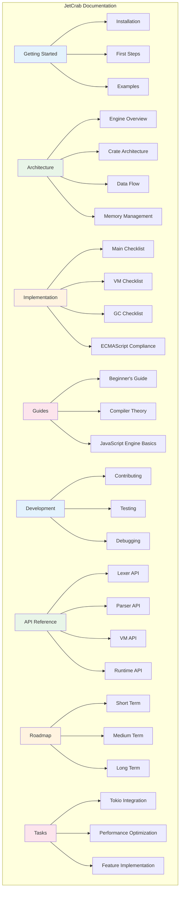

# JetCrab Documentation

Welcome to the JetCrab documentation! This directory contains comprehensive documentation for the JetCrab JavaScript engine project.

## Documentation Structure

### [Getting Started](./getting-started/)
Quick start guides for new users:
- **[Installation](./getting-started/installation.md)** - Set up your development environment
- **[First Steps](./getting-started/first-steps.md)** - Your first JetCrab project
- **[Examples](./getting-started/examples.md)** - Basic usage examples

### [Architecture](./architecture/)
Technical architecture and design documents:
- **[Engine Overview](./architecture/engine-overview.md)** - High-level architecture
- **[Crate Architecture](./architecture/crate-architecture.md)** - Individual crate responsibilities
- **[Data Flow](./architecture/data-flow.md)** - How data flows through the engine
- **[Memory Management](./architecture/memory-management.md)** - Heap and GC design

### [Implementation](./implementation/)
Project implementation status and progress tracking:
- **[Main Checklist](./implementation/main-checklist.md)** - Overall project status and milestones
- **[VM Checklist](./implementation/vm-checklist.md)** - Virtual Machine implementation progress
- **[GC Checklist](./implementation/gc-checklist.md)** - Garbage Collection implementation status
- **[ECMAScript Compliance](./implementation/ecmascript-compliance.md)** - Feature compliance status

### [Guides](./guides/)
Comprehensive guides for understanding JetCrab:
- **[Beginner's Guide](./guides/beginners-guide.md)** - Complete introduction to JetCrab
- **[Compiler Theory](./guides/compiler-theory.md)** - Deep dive into compiler concepts
- **[JavaScript Engine Basics](./guides/javascript-engine-basics.md)** - Engine fundamentals

### [Development](./development/)
Development guides and technical information:
- **[Contributing](./development/contributing.md)** - Contribution guidelines
- **[Testing](./development/testing.md)** - Testing strategies and examples
- **[Debugging](./development/debugging.md)** - Debugging techniques and tools
- **[Performance](./development/performance.md)** - Optimization and benchmarking

### [API Reference](./api/)
API documentation and usage examples:
- **[Lexer API](./api/lexer-api.md)** - Tokenization and lexical analysis
- **[Parser API](./api/parser-api.md)** - Syntax analysis and AST generation
- **[VM API](./api/vm-api.md)** - Virtual machine and execution
- **[Runtime API](./api/runtime-api.md)** - Runtime environment and values

### [Roadmap](./roadmap/)
Project planning and future direction:
- **[Short Term](./roadmap/short-term.md)** - Next 3 months
- **[Medium Term](./roadmap/medium-term.md)** - Next 6 months
- **[Long Term](./roadmap/long-term.md)** - Next 12+ months

### [Tasks](./tasks/)
Current work items and implementation tasks:
- **[Tokio Integration](./tasks/tokio-integration-task.md)** - Async performance improvements
- **[Performance Optimization](./tasks/performance-optimization.md)** - Optimization tasks
- **[Feature Implementation](./tasks/feature-implementation.md)** - Feature development tasks

## Quick Navigation

### For New Contributors
1. Start with [Getting Started](./getting-started/) guides
2. Read [Beginner's Guide](./guides/beginners-guide.md) for comprehensive understanding
3. Review [Engine Overview](./architecture/engine-overview.md) for system design
4. Check [Implementation Status](./implementation/main-checklist.md) for current progress

### For Developers
1. [Architecture](./architecture/) for understanding the codebase
2. [Implementation Status](./implementation/) for current progress
3. [API Reference](./api/) for integration details
4. [Development Guides](./development/) for contribution guidelines

### For Maintainers
1. [Implementation Status](./implementation/) for project status
2. [Roadmap](./roadmap/) for future planning
3. [Tasks](./tasks/) for current work items
4. [Architecture](./architecture/) for system design decisions

## Documentation Standards

- **Language**: All documentation is written in English
- **Format**: Markdown with Mermaid diagrams for visual clarity
- **Structure**: Consistent headings and organization
- **Updates**: Regular updates to match codebase changes
- **Accessibility**: Clear explanations for different skill levels

## Contributing to Documentation

When contributing to documentation:

1. **Follow the structure** - Use existing patterns and organization
2. **Keep it updated** - Ensure documentation matches the current codebase
3. **Use Mermaid diagrams** - Visual explanations where helpful
4. **Cross-reference** - Link to related documentation
5. **Test links** - Verify all internal links work correctly

## Project Status

- **Current Version**: 0.1.0
- **Status**: Basic implementation with compilation issues being resolved
- **ECMAScript Compliance**: ~10% (basic features implemented)
- **Next Priority**: Fix compilation errors and stabilize API

## Need Help?

- Check the [Beginner's Guide](./guides/beginners-guide.md) for detailed explanations
- Review [Architecture Documentation](./architecture/) for technical details
- Look at [Implementation Status](./implementation/) for current progress
- Join our community discussions for additional support 