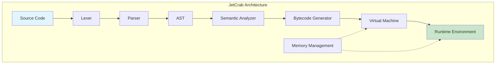

# Architecture

This directory contains detailed technical architecture documentation for JetCrab.

## Overview

JetCrab follows a modular architecture with clear separation of concerns. Each component handles a specific aspect of JavaScript engine functionality, from lexical analysis to bytecode execution.

## Architecture Documents

### **System Architecture**
- **[Engine Overview](./engine-overview.md)** - High-level system architecture
  - Complete pipeline from source code to execution
  - Component relationships and data flow
  - Design principles and performance characteristics

- **[Crate Architecture](./crate-architecture.md)** - Individual component details
  - Detailed breakdown of each module
  - Public APIs and dependencies
  - Implementation specifics

### **Data Flow and Design**
- **[Data Flow](./data-flow.md)** - How data moves through the system
  - Source code processing pipeline
  - Memory management and garbage collection
  - Performance optimization strategies

- **[Memory Management](./memory-management.md)** - Heap and GC design
  - Memory allocation strategies
  - Garbage collection algorithms
  - Performance considerations

### **Future Planning**
- **[Crate Consolidation Plan](./crate-consolidation-plan.md)** - Migration strategy
  - Current multi-crate structure
  - Consolidation benefits and timeline
  - Migration steps and considerations

- **[Ideal Project Structure](./ideal-new-project-structure.md)** - Long-term vision
  - Target architecture design
  - Scalability considerations
  - Implementation roadmap

## Architecture Principles

### 1. **Modularity**
- Each component has clear responsibilities
- Loose coupling between components
- Well-defined interfaces

### 2. **Performance**
- Efficient data structures and algorithms
- Optimized bytecode instruction set
- Memory-conscious design

### 3. **Standards Compliance**
- ECMAScript specification adherence
- V8 engine compatibility where applicable
- Modern JavaScript feature support

### 4. **Extensibility**
- Plugin-based architecture potential
- Visitor pattern for AST traversal
- Configurable components

### 5. **Reliability**
- Comprehensive error handling
- Robust error recovery mechanisms
- Memory safety through Rust

## Component Architecture

## Performance Characteristics

- **Lexical Analysis**: O(n) where n is source length
- **Parsing**: O(n) with error recovery
- **Bytecode Generation**: O(n) where n is AST nodes
- **VM Execution**: Optimized for common JavaScript patterns

## Integration Points

### **External APIs**
- **Embedding**: Public API for application integration
- **Tooling**: AST serialization for development tools
- **Debugging**: Source mapping and position tracking
- **Profiling**: Performance measurement and analysis

### **Internal Interfaces**
- **Component Communication**: Well-defined interfaces
- **Data Flow**: Structured data passing between components
- **Error Handling**: Consistent error propagation
- **Configuration**: Flexible engine configuration

## Related Documentation

- **[Implementation Status](../implementation/)** - Current implementation progress
- **[Getting Started](../getting-started/)** - Quick start guides
- **[API Documentation](../api/)** - Integration details
- **[Development Guides](../development/)** - Contribution guidelines 