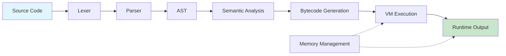

# JetCrab Architecture Documentation

Welcome to the JetCrab architecture documentation! This directory contains detailed information about the system design, module organization, and architectural decisions.

## 📚 **Architecture Documents**

### **System Overview**
- **[Engine Overview](./engine-overview.md)** - High-level system architecture and design principles
- **[Module Architecture](./module-architecture.md)** - **MAIN DOCUMENT** - Detailed module organization and responsibilities

## 🏗️ **Architecture Overview**

**JetCrab is designed as a single Rust crate with multiple modules, each handling a specific aspect of JavaScript engine functionality.**

### **Key Design Principles**
- **Single Crate**: All functionality is contained within one `jetcrab` crate
- **Modular Design**: Clear separation of concerns through Rust modules
- **Layered Architecture**: Compilation pipeline with well-defined stages
- **Performance Focus**: Optimized for speed and memory efficiency

### **Module Organization**
```
src/
├── lib.rs          # Public API and module declarations
├── lexer/          # Tokenization and lexical analysis
├── ast/            # Abstract Syntax Tree representation
├── parser/         # Syntax analysis and AST construction
├── semantic/       # Type checking and semantic validation
├── bytecode/       # Code generation and optimization
├── vm/             # Virtual machine and execution
├── runtime/        # Runtime environment and built-ins
├── memory/         # Memory management and garbage collection
└── api/            # Public API and integration interface
```

## 🔄 **Data Flow Architecture**


```mermaid
graph LR
    A[Source Code] --> B[Lexer]
    B --> C[Parser]
    C --> D[AST]
    D --> E[Semantic Analysis]
    E --> F[Bytecode Generation]
    F --> G[VM Execution]
    G --> H[Runtime Output]
    
    I[Memory Management] -.-> G
    I -.-> H
    
    style A fill:#e1f5fe
    style H fill:#c8e6c9
```

## 🎯 **Module Responsibilities**

### **Core Pipeline Modules**
- **lexer**: Converts source code to tokens
- **parser**: Builds AST from tokens
- **semantic**: Validates AST semantics
- **bytecode**: Generates executable code
- **vm**: Executes bytecode

### **Support Modules**
- **runtime**: Provides execution environment
- **memory**: Manages memory allocation
- **api**: Exposes public interface

## 🚀 **Getting Started with Architecture**

### **For New Contributors**
1. Start with [Engine Overview](./engine-overview.md) for high-level understanding
2. Review [Module Architecture](./module-architecture.md) for detailed module information
3. Explore the actual source code in `src/` directory

### **For Developers**
1. Understand the module dependencies and data flow
2. Identify which module to modify for your changes
3. Follow the established patterns and interfaces

### **For Maintainers**
1. Ensure module boundaries remain clear
2. Maintain consistent module structure
3. Document architectural decisions and changes

## 📝 **Architecture Guidelines**

### **Module Design Principles**
- **Single Responsibility**: Each module has one clear purpose
- **Minimal Coupling**: Modules depend only on what they need
- **Clear Interfaces**: Well-defined public APIs between modules
- **Consistent Structure**: Similar organization across all modules

### **Performance Considerations**
- **Efficient Data Flow**: Minimize data copying between modules
- **Memory Management**: Shared memory where appropriate
- **Optimization Passes**: Multiple optimization opportunities in the pipeline

### **Extensibility**
- **Plugin System**: Easy to add new functionality
- **Module Independence**: New modules can be added without affecting existing ones
- **Interface Stability**: Public APIs remain stable across versions

## 🔗 **Related Documentation**

### **Implementation Details**
- **[Implementation Status](../implementation/)** - Current implementation progress
- **[Getting Started](../getting-started/)** - Setup and first steps
- **[API Documentation](../api/)** - Public interface details

### **Development Guides**
- **[Contributing Guidelines](../CONTRIBUTING.md)** - How to contribute
- **[Code of Conduct](../CODE_OF_CONDUCT.md)** - Community standards

## 📊 **Current Architecture Status**

- **Design**: ✅ Well-defined and documented
- **Implementation**: 🔄 Basic structure complete, some modules need completion
- **Documentation**: ✅ Architecture well documented
- **Testing**: ❌ Some architectural assumptions need validation

---

**Note**: This architecture documentation reflects the current single-crate, multi-module design of JetCrab. The project uses Rust modules for organization, not separate crates. 