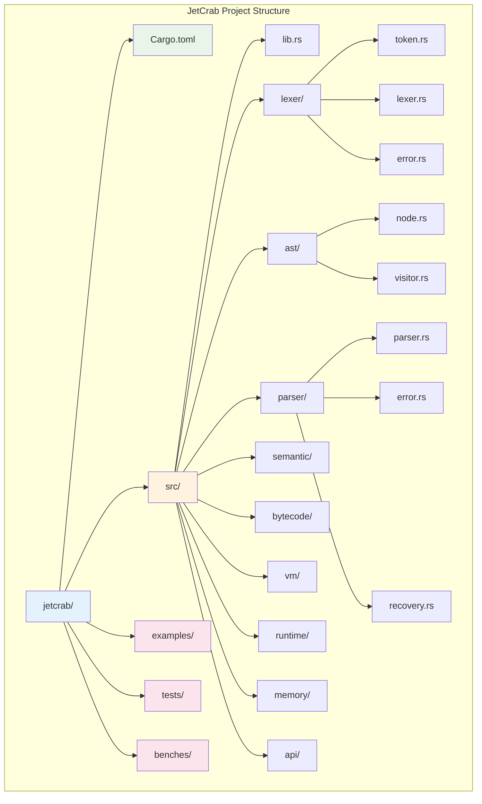
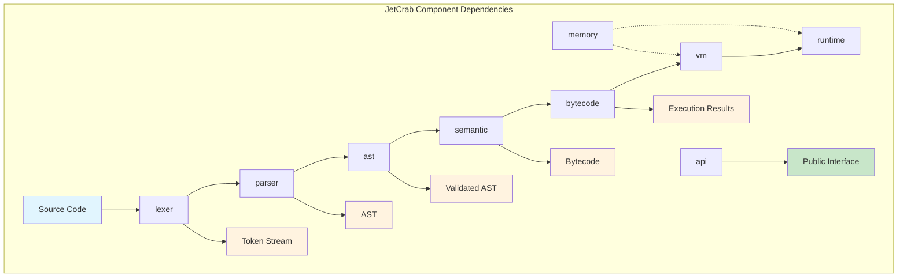

# JetCrab Architecture

## Overview

JetCrab is organized as a single crate with modular components, each handling a specific aspect of JavaScript engine functionality. This document provides detailed information about each component's architecture, responsibilities, and interfaces.

## Project Structure



## Component Relationships



## Individual Component Architecture

### lexer

**Purpose**: Converts JavaScript source code into tokens

#### Architecture
```
src/
├── lib.rs          # Public API and module declarations
├── token.rs        # Token definitions and metadata
├── lexer.rs        # Main lexer implementation
└── error.rs        # Lexer-specific error types
```

#### Key Components
- **Token**: Represents individual lexical units with position information
- **TokenKind**: Enumeration of all possible token types
- **Lexer**: Main tokenization engine with state management
- **Position**: Source code position tracking (line/column)

#### Public API
```rust
pub fn tokenize(source: &str) -> Result<Vec<Token>, LexerError>
pub fn tokenize_fallback(source: &str) -> Vec<Token>
pub struct Lexer { /* ... */ }
pub struct Token { /* ... */ }
pub enum TokenKind { /* ... */ }
```

#### Dependencies
- `thiserror`: Error handling
- `serde`: Serialization support

### ast

**Purpose**: Represents JavaScript program structure as Abstract Syntax Tree

#### Architecture
```
src/
├── lib.rs          # Public API and module declarations
├── node.rs         # AST node definitions
└── visitor.rs      # Visitor pattern implementation
```

#### Key Components
- **Node**: Enumeration of all AST node types
- **Visitor**: Traversal pattern for AST analysis
- **Serialization**: JSON serialization/deserialization support

#### Public API
```rust
pub enum Node { /* All AST node variants */ }
pub trait Visitor { /* Visitor pattern interface */ }
pub struct NodeCounter { /* Example visitor implementation */ }
```

#### Dependencies
- `serde`: Serialization support

### parser

**Purpose**: Converts tokens into Abstract Syntax Tree

#### Architecture
```
src/
├── lib.rs          # Public API and module declarations
├── parser.rs       # Main parser implementation
├── error.rs        # Parser-specific error types
└── recovery.rs     # Error recovery mechanisms
```

#### Key Components
- **Parser**: Main parsing engine with recursive descent implementation
- **ParseResult**: Result type for parsing operations
- **Error Recovery**: Mechanisms for handling syntax errors gracefully

#### Public API
```rust
pub fn parse(tokens: &[Token]) -> ParseResult<Node>
pub struct Parser { /* ... */ }
pub enum ParseError { /* ... */ }
```

#### Dependencies
- `v8_lexer`: Token input
- `v8_ast`: AST output
- `thiserror`: Error handling

### v8_semantic

**Purpose**: Validates program semantics and performs static analysis

#### Architecture
```
src/
├── lib.rs          # Public API and module declarations
├── analyzer.rs     # Main semantic analyzer
├── scope.rs        # Scope management
├── types.rs        # Type system
└── errors.rs       # Semantic error types
```

#### Key Components
- **SemanticAnalyzer**: Main analysis engine
- **Scope**: Variable and function scope management
- **Type**: Type system implementation
- **Error Detection**: Semantic error reporting

#### Public API
```rust
pub fn analyze(ast: &Node) -> Result<(), Vec<SemanticError>>
pub struct SemanticAnalyzer { /* ... */ }
pub struct Scope { /* ... */ }
pub enum Type { /* ... */ }
```

#### Dependencies
- `v8_ast`: AST input
- `thiserror`: Error handling

### v8_bytecode

**Purpose**: Generates bytecode from Abstract Syntax Tree

#### Architecture
```
src/
├── lib.rs          # Public API and module declarations
├── generator.rs    # Bytecode generation engine
├── instructions.rs # Instruction set definition
└── tests.rs        # Internal test utilities
```

#### Key Components
- **BytecodeGenerator**: Main generation engine
- **Instruction**: Enumeration of all bytecode instructions
- **ConstantPool**: Optimization for literal storage

#### Public API
```rust
pub fn generate(ast: &Node) -> Bytecode
pub struct BytecodeGenerator { /* ... */ }
pub enum Instruction { /* ... */ }
pub struct ConstantPool { /* ... */ }
```

#### Dependencies
- `v8_ast`: AST input
- `thiserror`: Error handling

### v8_vm

**Purpose**: Executes bytecode instructions

#### Architecture
```
src/
├── lib.rs          # Public API and module declarations
├── executor.rs     # Main execution engine
├── bytecode.rs     # Bytecode representation
├── instructions.rs # Instruction implementations
├── frame.rs        # Call frame management
├── stack.rs        # Execution stack
├── registers.rs    # Register management
├── value.rs        # Runtime values
└── heap.rs         # Memory management
```

#### Key Components
- **Executor**: Main virtual machine engine
- **Frame**: Function call frame management
- **Stack**: Execution stack operations
- **Value**: Runtime value representation

#### Public API
```rust
pub fn execute(bytecode: &Bytecode) -> Result<Value, VMError>
pub struct Executor { /* ... */ }
pub struct Frame { /* ... */ }
pub struct Stack { /* ... */ }
pub enum Value { /* ... */ }
```

#### Dependencies
- `v8_ast`: AST types for values
- `v8_runtime`: Runtime environment
- `thiserror`: Error handling

### v8_runtime

**Purpose**: Provides runtime environment and value system

#### Architecture
```
src/
├── lib.rs          # Public API and module declarations
├── value.rs        # Runtime value system
├── object.rs       # Object representation
├── function.rs     # Function execution
└── context.rs      # Execution context
```

#### Key Components
- **Value**: Runtime value representation
- **Object**: Object and array management
- **Function**: Function execution framework
- **Context**: Execution context management

#### Public API
```rust
pub enum Value { /* Runtime value types */ }
pub struct Object { /* ... */ }
pub struct Function { /* ... */ }
pub struct Context { /* ... */ }
```

#### Dependencies
- `thiserror`: Error handling

### v8_gc

**Purpose**: Manages memory allocation and garbage collection

#### Architecture
```
src/
├── lib.rs          # Public API and module declarations
├── collector.rs    # Garbage collection algorithms
├── heap.rs         # Heap management
├── mark_sweep.rs   # Mark-sweep implementation
└── object_tracker.rs # Object lifecycle tracking
```

#### Key Components
- **Collector**: Main garbage collection engine
- **Heap**: Memory allocation and management
- **MarkSweepCollector**: Mark-sweep algorithm implementation
- **ObjectTracker**: Object lifecycle management

#### Public API
```rust
pub fn collect() -> CollectionStats
pub struct Collector { /* ... */ }
pub struct Heap { /* ... */ }
pub struct MarkSweepCollector { /* ... */ }
```

#### Dependencies
- `thiserror`: Error handling

### v8_api

**Purpose**: Provides public API for external integration

#### Architecture
```
src/
├── lib.rs          # Public API and module declarations
├── engine.rs       # Engine initialization and configuration
├── compiler.rs     # Compilation pipeline
└── interpreter.rs  # Interpretation interface
```

#### Key Components
- **Engine**: Main engine interface
- **Compiler**: Compilation pipeline coordination
- **Interpreter**: Execution interface

#### Public API
```rust
pub struct Engine { /* Main engine interface */ }
pub fn compile(source: &str) -> Result<Bytecode, CompileError>
pub fn execute(bytecode: &Bytecode) -> Result<Value, RuntimeError>
```

#### Dependencies
- All other crates for full functionality

## Crate Dependencies

### Dependency Graph
```
v8_api
├── v8_lexer
├── v8_ast
├── v8_parser
├── v8_semantic
├── v8_bytecode
├── v8_vm
├── v8_runtime
└── v8_gc

v8_parser
├── v8_lexer
└── v8_ast

v8_semantic
└── v8_ast

v8_bytecode
└── v8_ast

v8_vm
├── v8_ast
└── v8_runtime
```

### Shared Dependencies
- **thiserror**: Error handling across all crates
- **serde**: Serialization support where needed

## Interface Design

### Error Handling
- Consistent error types using `thiserror`
- Proper error propagation between crates
- Meaningful error messages with context

### Data Flow
- Clear input/output contracts between crates
- Immutable data structures where possible
- Efficient data passing to minimize copying

### Configuration
- Flexible configuration options
- Environment-based settings
- Performance tuning parameters

## Testing Strategy

### Unit Tests
- Each crate has comprehensive unit tests
- Tests are co-located with source code
- Mock objects for isolated testing

### Integration Tests
- End-to-end testing in `tests/` directory
- Cross-crate functionality testing
- Performance benchmarking

### Test Coverage
- Aim for 100% test coverage
- Edge case testing
- Error condition testing

## Performance Considerations

### Memory Management
- Efficient data structures
- Minimal memory allocation
- Garbage collection optimization

### Execution Speed
- Optimized algorithms
- Caching strategies
- Profile-guided optimization

### Scalability
- Support for large source files
- Efficient AST representation
- Optimized bytecode execution

## Future Architecture Evolution

### Plugin System
- Extensible compiler pipeline
- Custom optimization passes
- Language extension support

### Parallel Processing
- Multi-threaded compilation
- Parallel garbage collection
- Concurrent execution

### Advanced Optimizations
- JIT compilation
- Profile-guided optimization
- Advanced garbage collection algorithms

---

*This document provides detailed information about the crate architecture. For implementation details, see the individual crate documentation.* 