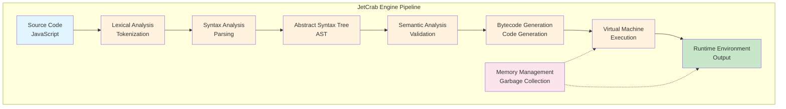
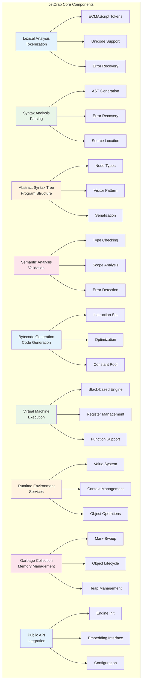
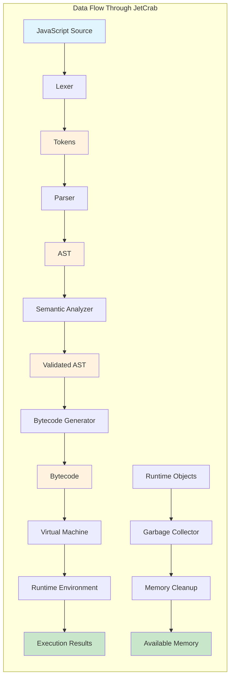
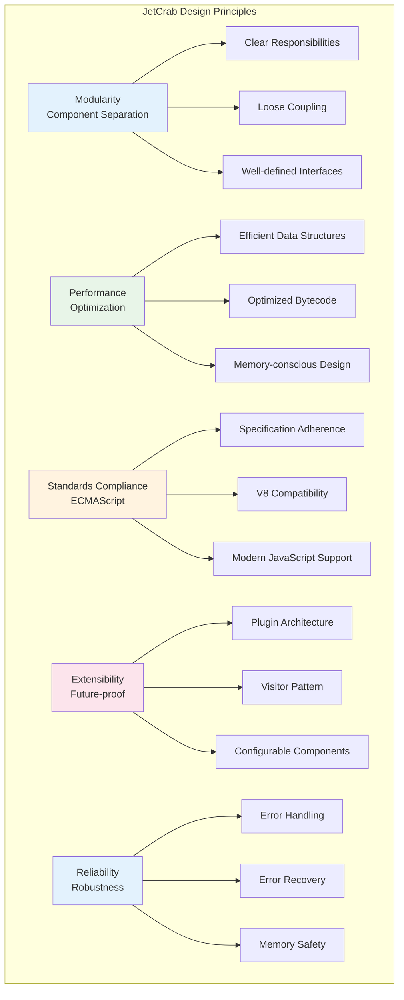

# JetCrab Engine Overview

## Introduction

JetCrab is a modern JavaScript engine implemented in Rust, inspired by Google's V8 architecture. The engine provides a complete JavaScript execution pipeline from source code parsing to bytecode execution.

## High-Level Architecture



## Core Components



### 1. Lexical Analysis (v8_lexer)
- **Purpose**: Converts source code into tokens
- **Features**:
  - ECMAScript-compliant tokenization
  - Unicode support for identifiers
  - Precise position tracking
  - Error handling and recovery
- **Output**: Stream of tokens with metadata

### 2. Syntax Analysis (v8_parser)
- **Purpose**: Converts tokens into Abstract Syntax Tree (AST)
- **Features**:
  - ECMAScript 5/6+ parsing
  - Error recovery mechanisms
  - Source location preservation
  - Complex JavaScript construct handling
- **Output**: Validated AST nodes

### 3. Abstract Syntax Tree (v8_ast)
- **Purpose**: Represents program structure
- **Features**:
  - Complete ECMAScript node types
  - Serialization support (JSON)
  - Visitor pattern implementation
  - Source location tracking
- **Output**: Structured program representation

### 4. Semantic Analysis (v8_semantic)
- **Purpose**: Validates program semantics
- **Features**:
  - Type checking and scope analysis
  - ECMAScript validation rules
  - Error detection and reporting
  - Static analysis capabilities
- **Output**: Validated and analyzed AST

### 5. Bytecode Generation (v8_bytecode)
- **Purpose**: Converts AST into executable bytecode
- **Features**:
  - 100% AST coverage
  - V8 Ignition-inspired instruction set
  - Constant pool optimization
  - All ECMAScript features supported
- **Output**: Optimized bytecode instructions

### 6. Virtual Machine (v8_vm)
- **Purpose**: Executes bytecode instructions
- **Features**:
  - Stack-based execution engine
  - Register management system
  - Function and closure support
  - Memory management integration
- **Output**: Program execution results

### 7. Runtime Environment (v8_runtime)
- **Purpose**: Provides runtime services
- **Features**:
  - Value system (primitives and objects)
  - Context and scope management
  - Function execution framework
  - Object and array operations
- **Output**: Runtime values and objects

### 8. Garbage Collection (v8_gc)
- **Purpose**: Manages memory allocation and cleanup
- **Features**:
  - Mark-sweep collection algorithm
  - Object lifecycle tracking
  - Memory optimization
  - Heap management
- **Output**: Cleaned memory space

### 9. Public API (v8_api)
- **Purpose**: External integration interface
- **Features**:
  - Engine initialization and configuration
  - Public interfaces for embedding
  - Integration layer for applications
- **Output**: Accessible engine functionality

## Data Flow



### 1. Source Code Processing
```
JavaScript Source → Lexer → Tokens → Parser → AST
```

### 2. Analysis and Validation
```
AST → Semantic Analyzer → Validated AST → Bytecode Generator → Bytecode
```

### 3. Execution
```
Bytecode → Virtual Machine → Runtime Environment → Execution Results
```

### 4. Memory Management
```
Runtime Objects → Garbage Collector → Memory Cleanup → Available Memory
```

## Design Principles



### 1. Modularity
- Each component is a separate crate with clear responsibilities
- Loose coupling between components
- Well-defined interfaces between modules

### 2. Performance
- Efficient data structures and algorithms
- Optimized bytecode instruction set
- Memory-conscious design
- Benchmarking and profiling support

### 3. Standards Compliance
- ECMAScript specification adherence
- V8 engine compatibility where applicable
- Modern JavaScript feature support

### 4. Extensibility
- Plugin-based architecture potential
- Visitor pattern for AST traversal
- Configurable components
- API for external extensions

### 5. Reliability
- Comprehensive error handling
- Robust error recovery mechanisms
- Extensive testing coverage
- Memory safety through Rust

## Performance Characteristics

```mermaid
graph TB
    subgraph "Performance Characteristics"
        A[Memory Usage] --> A1[Lexer: Minimal Footprint]
        A --> A2[Parser: AST-based]
        A --> A3[VM: Stack-based]
        A --> A4[GC: Automatic Management]
        
        B[Execution Speed] --> B1[Lexical Analysis: O(n)]
        B --> B2[Parsing: O(n) with Recovery]
        B --> B3[Bytecode Generation: O(n)]
        B --> B4[VM Execution: Optimized]
        
        C[Scalability] --> C1[Large Files: Streaming]
        C --> C2[Complex Programs: Optimized]
        C --> C3[Memory Pressure: GC]
    end
    
    style A fill:#e3f2fd
    style B fill:#e8f5e8
    style C fill:#fff3e0
```

### Memory Usage
- **Lexer**: Minimal memory footprint, streaming processing
- **Parser**: AST-based, memory proportional to source size
- **VM**: Stack-based execution, efficient memory usage
- **GC**: Automatic memory management with optimization

### Execution Speed
- **Lexical Analysis**: O(n) where n is source length
- **Parsing**: O(n) with error recovery
- **Bytecode Generation**: O(n) where n is AST nodes
- **VM Execution**: Optimized for common JavaScript patterns

### Scalability
- **Large Files**: Streaming lexer, efficient AST representation
- **Complex Programs**: Optimized bytecode, efficient VM
- **Memory Pressure**: Garbage collection, memory optimization

## Integration Points

### External APIs
- **Embedding**: Public API for application integration
- **Tooling**: AST serialization for development tools
- **Debugging**: Source mapping and position tracking
- **Profiling**: Performance measurement and analysis

### Internal Interfaces
- **Component Communication**: Well-defined interfaces
- **Data Flow**: Structured data passing between components
- **Error Handling**: Consistent error propagation
- **Configuration**: Flexible engine configuration

## Future Extensions

### Planned Features
- **JIT Compilation**: Machine code generation for performance
- **Optimizations**: Advanced bytecode and runtime optimizations
- **WebAssembly**: WASM integration and execution
- **Modules**: ES6 module system implementation

### Architecture Evolution
- **Plugin System**: Extensible compiler pipeline
- **Parallel Processing**: Multi-threaded execution
- **Memory Management**: Advanced garbage collection algorithms
- **Performance Profiling**: Real-time performance analysis

---

*This document provides a high-level overview of the JetCrab engine architecture. For detailed implementation information, see the individual component documentation.* 