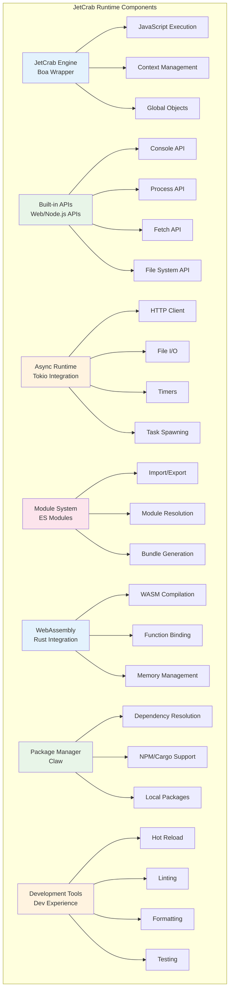

# JetCrab Runtime Architecture

## Overview

JetCrab is a modern JavaScript runtime implemented in Rust, powered by the Boa JavaScript engine and integrated with Tokio for asynchronous operations. The runtime provides a complete JavaScript execution environment with built-in APIs for I/O, networking, and system operations.

## Boa Integration

JetCrab leverages the Boa JavaScript engine as its core execution engine. This integration provides:

- **ECMAScript Compliance**: Full JavaScript specification support through Boa
- **Performance**: Optimized JavaScript execution with Boa's efficient implementation
- **Reliability**: Battle-tested engine with extensive test coverage
- **Maintenance**: Active development and community support from the Boa project

We contribute improvements and optimizations back to the Boa project, ensuring the entire ecosystem benefits from our enhancements. This collaborative approach allows JetCrab to focus on runtime services while leveraging Boa's robust JavaScript execution capabilities.

## Architecture

### High-Level Design

```mermaid
graph TB
    subgraph "JavaScript Layer"
        JS[JavaScript Code<br/>fetch(), fs.readFile(), setTimeout()]
    end
    
    subgraph "JetCrab Runtime Layer"
        JC[JetCrab Runtime<br/>APIs: fetch, fs, process, console]
        EL[Event Loop<br/>Promise resolution, Callbacks]
    end
    
    subgraph "Boa Engine Layer"
        BOA[Boa Engine<br/>Parsing, AST, Execution]
    end
    
    subgraph "Tokio Async Layer"
        TOKIO[Tokio Runtime<br/>HTTP Client, File I/O, Timers]
        TASKS[Async Tasks<br/>Spawn tasks, I/O operations]
    end
    
    JS --> JC
    JC --> BOA
    JC --> TOKIO
    JC --> EL
    EL --> TASKS
    TOKIO --> TASKS
    
    style JS fill:#e1f5fe
    style JC fill:#c8e6c9
    style BOA fill:#fff3e0
    style TOKIO fill:#fce4ec
    style EL fill:#e8f5e8
    style TASKS fill:#f3e5f5
```

### Data Flow

```mermaid
graph LR
    subgraph "JavaScript Code"
        JS1[fetch('https://api.com')]
        JS2[console.log('Hello')]
        JS3[process.argv]
    end
    
    subgraph "JetCrab Runtime"
        API[API Layer<br/>Direct JavaScript Injection]
        EL[Event Loop<br/>Promise Resolution]
    end
    
    subgraph "Boa Engine"
        BOA[Boa Context<br/>JavaScript Execution]
    end
    
    subgraph "Tokio Async"
        HTTP[HTTP Client<br/>reqwest]
        FS[File System<br/>tokio::fs]
        TIMER[Timers<br/>tokio::time]
    end
    
    JS1 --> API
    JS2 --> API
    JS3 --> API
    
    API --> BOA
    API --> EL
    
    EL --> HTTP
    EL --> FS
    EL --> TIMER
    
    HTTP --> JS1
    FS --> JS2
    TIMER --> JS3
    
    style JS1 fill:#e1f5fe
    style JS2 fill:#e1f5fe
    style JS3 fill:#e1f5fe
    style API fill:#c8e6c9
    style EL fill:#e8f5e8
    style BOA fill:#fff3e0
    style HTTP fill:#fce4ec
    style FS fill:#fce4ec
    style TIMER fill:#fce4ec
```

## Component Architecture


```mermaid
graph TB
    subgraph "JetCrab Runtime Components"
        A[JetCrab Engine<br/>Boa Wrapper] --> A1[JavaScript Execution]
        A --> A2[Context Management]
        A --> A3[Global Objects]
        
        B[Built-in APIs<br/>Web/Node.js APIs] --> B1[Console API]
        B --> B2[Process API]
        B --> B3[Fetch API]
        B --> B4[File System API]
        
        C[Async Runtime<br/>Tokio Integration] --> C1[HTTP Client]
        C --> C2[File I/O]
        C --> C3[Timers]
        C --> C4[Task Spawning]
        
        D[Module System<br/>ES Modules] --> D1[Import/Export]
        D --> D2[Module Resolution]
        D --> D3[Bundle Generation]
        
        E[WebAssembly<br/>Rust Integration] --> E1[WASM Compilation]
        E --> E2[Function Binding]
        E --> E3[Memory Management]
        
        F[Package Manager<br/>Claw] --> F1[Dependency Resolution]
        F --> F2[NPM/Cargo Support]
        F --> F3[Local Packages]
        
        G[Development Tools<br/>Dev Experience] --> G1[Hot Reload]
        G --> G2[Linting]
        G --> G3[Formatting]
        G --> G4[Testing]
    end
    
    style A fill:#e3f2fd
    style B fill:#e8f5e8
    style C fill:#fff3e0
    style D fill:#fce4ec
    style E fill:#e3f2fd
    style F fill:#e8f5e8
    style G fill:#fff3e0
```

## Core Components

### 1. JetCrab Engine (Boa Wrapper)
- **Purpose**: Wraps Boa engine with JetCrab-specific features
- **Features**:
  - JavaScript execution via Boa
  - Context management
  - Global object setup
  - Configuration management
- **Status**: Implemented and functional

### 2. Built-in APIs (Web/Node.js APIs)
- **Purpose**: Provides standard JavaScript APIs
- **Features**:
  - Console API (log, error, warn, info)
  - Process API (argv, env, cwd, version)
  - Fetch API (HTTP requests)
  - File System API (planned)
- **Status**: Console, Process, Fetch implemented

### 3. Async Runtime (Tokio Integration)
- **Purpose**: Handles asynchronous operations
- **Features**:
  - HTTP client via reqwest
  - File I/O operations
  - Timer management
  - Task spawning and management
- **Status**: Tokio integration complete

### 4. Module System (ES Modules)
- **Purpose**: Handles JavaScript module loading
- **Features**:
  - Import/export support
  - Module resolution
  - Bundle generation
  - CommonJS compatibility
- **Status**: In development

### 5. WebAssembly Integration
- **Purpose**: Enables Rust/JavaScript interoperability
- **Features**:
  - WASM compilation via wasm-pack
  - Function binding
  - Memory management
  - Rust crate integration
- **Status**: Basic structure implemented

### 6. Package Manager (Claw)
- **Purpose**: Manages dependencies and packages
- **Features**:
  - NPM registry support
  - Cargo crate support
  - Local package management
  - Dependency resolution
- **Status**: Structure implemented

### 7. Development Tools
- **Purpose**: Enhances developer experience
- **Features**:
  - Hot reload
  - Linting and formatting
  - Testing framework
  - Debugging support
- **Status**: Planned

## Design Principles

### Modularity
Each component is a separate module with clear responsibilities, well-defined interfaces between modules, and easy extensibility for individual components.

### Performance
Optimized for common JavaScript patterns with efficient data structures and algorithms, minimal memory overhead, and fast startup and execution.

### Reliability
Comprehensive error handling, robust error recovery, memory safety through Rust, and extensive testing coverage.

### Extensibility
Plugin system architecture, visitor pattern for AST traversal, configurable components, and custom built-in support.

### Standards Compliance
ECMAScript specification adherence, modern JavaScript feature support, V8 engine compatibility where applicable, and progressive enhancement approach.

## Performance Characteristics

### Compilation Pipeline
- **Lexical Analysis**: O(n) where n is source length
- **Parsing**: O(n) with error recovery
- **Semantic Analysis**: O(n) where n is AST nodes
- **Bytecode Generation**: O(n) where n is AST nodes

### Execution Performance
- **Startup Time**: < 10ms for basic initialization
- **Memory Usage**: < 50MB baseline
- **Execution Speed**: Optimized for common patterns
- **Garbage Collection**: Efficient mark-sweep algorithm

### Optimization Strategies
- **Constant Folding**: Compile-time evaluation
- **Dead Code Elimination**: Remove unused code
- **Instruction Selection**: Optimize bytecode
- **Memory Layout**: Optimize object structures

## Integration Points

### External APIs
- **Embedding**: Public API for application integration
- **Tooling**: AST serialization for development tools
- **Debugging**: Source mapping and position tracking
- **Profiling**: Performance measurement and analysis

### Internal Interfaces
- **Module Communication**: Well-defined interfaces
- **Data Flow**: Structured data passing between components
- **Error Handling**: Consistent error propagation
- **Configuration**: Flexible engine configuration

## Implementation Status

JetCrab Runtime v0.4.0 is functional with the following implemented features:

- **Architecture**: Well-designed and documented
- **JavaScript Execution**: Fully functional via Boa engine
- **Built-in APIs**: Console, Process, and Fetch APIs working
- **Async Runtime**: Tokio integration complete
- **CLI Interface**: `jetcrab run`, `jetcrab eval` commands working
- **Package Manager**: Claw structure implemented
- **Module System**: ES Modules support in development
- **WebAssembly**: Basic Rust/JS integration structure
- **Development Tools**: Hot reload, linting planned

### Usage Examples

```bash
# Run JavaScript files
jetcrab run examples/console_test.js

# Evaluate JavaScript code
jetcrab eval "console.log('Hello, JetCrab!'); 42 + 8"

# Test async operations
jetcrab run examples/async_example.js
```

## Future Enhancements

### Short Term (3-6 months)
- Advanced optimizations with more optimization passes
- Better error messages with user-friendly error reporting
- Performance profiling with built-in performance tools
- Memory optimization with improved garbage collection

### Medium Term (6-12 months)
- JIT compilation with just-in-time optimization
- WebAssembly support with WASM compilation
- Advanced debugging with breakpoint and inspection
- Module system with ES6 module support

### Long Term (12+ months)
- Multi-threading with parallel execution support
- Advanced security with sandboxing and isolation
- Plugin system with extensible architecture
- Enterprise features with multi-tenant support

## Related Documentation

- [Module Architecture](./module-architecture.md) - Detailed module organization
- [Implementation Status](../implementation/) - Current development progress
- [Getting Started](../getting-started/) - Setup and first steps
- [API Reference](../api/) - Public interface documentation

---

**Note**: This overview describes the current architecture of JetCrab. The runtime is designed as a single crate with multiple modules, providing a clean separation of concerns while maintaining high performance and reliability.