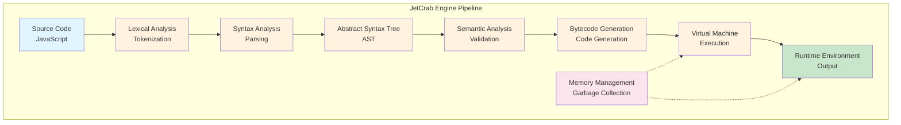
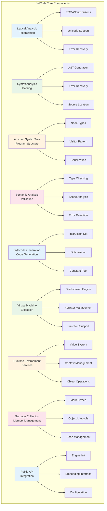

# JetCrab Engine Overview

## Introduction

JetCrab is a modern JavaScript engine implemented in Rust, inspired by Google's V8 architecture. The engine provides a complete JavaScript execution pipeline from source code parsing to bytecode execution.

## High-Level Architecture

```mermaid
graph TB
    subgraph "JetCrab Engine Pipeline"
        A[Source Code<br/>JavaScript] --> B[Lexical Analysis<br/>Tokenization]
        B --> C[Syntax Analysis<br/>Parsing]
        C --> D[Abstract Syntax Tree<br/>AST]
        D --> E[Semantic Analysis<br/>Validation]
        E --> F[Bytecode Generation<br/>Code Generation]
        F --> G[Virtual Machine<br/>Execution]
        G --> H[Runtime Environment<br/>Output]
        
        I[Memory Management<br/>Garbage Collection] -.-> G
        I -.-> H
    end
    
    style A fill:#e1f5fe
    style H fill:#c8e6c9
    style B fill:#fff3e0
    style C fill:#fff3e0
    style D fill:#fff3e0
    style E fill:#fff3e0
    style F fill:#fff3e0
    style G fill:#fff3e0
    style I fill:#fce4ec
```

## Core Components

```mermaid
graph TB
    subgraph "JetCrab Core Components"
        A[Lexical Analysis<br/>Tokenization] --> A1[ECMAScript Tokens]
        A --> A2[Unicode Support]
        A --> A3[Error Recovery]
        
        B[Syntax Analysis<br/>Parsing] --> B1[AST Generation]
        B --> B2[Error Recovery]
        B --> B3[Source Location]
        
        C[Abstract Syntax Tree<br/>Program Structure] --> C1[Node Types]
        C --> C2[Visitor Pattern]
        C --> C3[Serialization]
        
        D[Semantic Analysis<br/>Validation] --> D1[Type Checking]
        D --> D2[Scope Analysis]
        D --> D3[Error Detection]
        
        E[Bytecode Generation<br/>Code Generation] --> E1[Instruction Set]
        E --> E2[Optimization]
        E --> E3[Constant Pool]
        
        F[Virtual Machine<br/>Execution] --> F1[Stack-based Engine]
        F --> F2[Register Management]
        F --> F3[Function Support]
        
        G[Runtime Environment<br/>Services] --> G1[Value System]
        G --> G2[Context Management]
        G --> G3[Object Operations]
        
        H[Garbage Collection<br/>Memory Management] --> H1[Mark-Sweep]
        H --> H2[Object Lifecycle]
        H --> H3[Heap Management]
        
        I[Public API<br/>Integration] --> I1[Engine Init]
        I --> I2[Embedding Interface]
        I --> I3[Configuration]
    end
    
    style A fill:#e3f2fd
    style B fill:#e8f5e8
    style C fill:#fff3e0
    style D fill:#fce4ec
    style E fill:#e3f2fd
    style F fill:#e8f5e8
    style G fill:#fff3e0
    style H fill:#fce4ec
    style I fill:#e3f2fd
```

### 1. Lexical Analysis (lexer module)
- **Purpose**: Converts source code into tokens
- **Features**:
  - ECMAScript-compliant tokenization
  - Unicode support for identifiers
  - Precise position tracking
  - Error handling and recovery
- **Output**: Stream of tokens with metadata

### 2. Syntax Analysis (parser module)
- **Purpose**: Converts tokens into Abstract Syntax Tree (AST)
- **Features**:
  - Recursive descent parsing
  - Error recovery strategies
  - Source location preservation
  - AST node generation
- **Output**: Complete AST representation

### 3. Abstract Syntax Tree (ast module)
- **Purpose**: Represents program structure
- **Features**:
  - Comprehensive node types
  - Visitor pattern support
  - Serialization capabilities
  - Position information
- **Output**: Structured program representation

### 4. Semantic Analysis (semantic module)
- **Purpose**: Validates program semantics
- **Features**:
  - Type checking
  - Scope analysis
  - Symbol resolution
  - Error detection
- **Output**: Validated AST with semantic information

### 5. Bytecode Generation (bytecode module)
- **Purpose**: Converts AST to executable bytecode
- **Features**:
  - Instruction generation
  - Constant pool management
  - Optimization passes
  - Code emission
- **Output**: Optimized bytecode instructions

### 6. Virtual Machine (vm module)
- **Purpose**: Executes bytecode instructions
- **Features**:
  - Stack-based execution
  - Register management
  - Function calls
  - Control flow
- **Output**: Program execution results

### 7. Runtime Environment (runtime module)
- **Purpose**: Provides execution services
- **Features**:
  - Built-in objects
  - Function implementations
  - Context management
  - Value system
- **Output**: Runtime services and values

### 8. Memory Management (memory module)
- **Purpose**: Manages memory allocation
- **Features**:
  - Heap management
  - Garbage collection
  - Memory allocation
  - Resource cleanup
- **Output**: Efficient memory usage

### 9. Public API (api module)
- **Purpose**: Exposes engine interface
- **Features**:
  - Engine initialization
  - Code evaluation
  - Configuration
  - Integration
- **Output**: Public API for applications

## Design Principles

### 1. **Modularity**
- Each component is a separate module with clear responsibilities
- Well-defined interfaces between modules
- Easy to extend and modify individual components

### 2. **Performance**
- Optimized for common JavaScript patterns
- Efficient data structures and algorithms
- Minimal memory overhead
- Fast startup and execution

### 3. **Reliability**
- Comprehensive error handling
- Robust error recovery
- Memory safety through Rust
- Extensive testing coverage

### 4. **Extensibility**
- Plugin system architecture
- Visitor pattern for AST traversal
- Configurable components
- Custom built-in support

### 5. **Standards Compliance**
- ECMAScript specification adherence
- Modern JavaScript feature support
- V8 engine compatibility where applicable
- Progressive enhancement approach

## Performance Characteristics

### **Compilation Pipeline**
- **Lexical Analysis**: O(n) where n is source length
- **Parsing**: O(n) with error recovery
- **Semantic Analysis**: O(n) where n is AST nodes
- **Bytecode Generation**: O(n) where n is AST nodes

### **Execution Performance**
- **Startup Time**: < 10ms for basic initialization
- **Memory Usage**: < 50MB baseline
- **Execution Speed**: Optimized for common patterns
- **Garbage Collection**: Efficient mark-sweep algorithm

### **Optimization Strategies**
- **Constant Folding**: Compile-time evaluation
- **Dead Code Elimination**: Remove unused code
- **Instruction Selection**: Optimize bytecode
- **Memory Layout**: Optimize object structures

## Integration Points

### **External APIs**
- **Embedding**: Public API for application integration
- **Tooling**: AST serialization for development tools
- **Debugging**: Source mapping and position tracking
- **Profiling**: Performance measurement and analysis

### **Internal Interfaces**
- **Module Communication**: Well-defined interfaces
- **Data Flow**: Structured data passing between components
- **Error Handling**: Consistent error propagation
- **Configuration**: Flexible engine configuration

## Future Enhancements

### **Short Term (3-6 months)**
- **Advanced Optimizations**: More optimization passes
- **Better Error Messages**: User-friendly error reporting
- **Performance Profiling**: Built-in performance tools
- **Memory Optimization**: Improved garbage collection

### **Medium Term (6-12 months)**
- **JIT Compilation**: Just-in-time optimization
- **WebAssembly Support**: WASM compilation
- **Advanced Debugging**: Breakpoint and inspection
- **Module System**: ES6 module support

### **Long Term (12+ months)**
- **Multi-threading**: Parallel execution support
- **Advanced Security**: Sandboxing and isolation
- **Plugin System**: Extensible architecture
- **Enterprise Features**: Multi-tenant support

## Related Documentation

- **[Module Architecture](./module-architecture.md)** - Detailed module organization
- **[Implementation Status](../implementation/)** - Current development progress
- **[Getting Started](../getting-started/)** - Setup and first steps
- **[API Reference](../api/)** - Public interface documentation

---

**Note**: This overview describes the current architecture of JetCrab. The engine is designed as a single crate with multiple modules, providing a clean separation of concerns while maintaining high performance and reliability.

## ⚠️ **Implementation Status Note**

**Important**: While this document describes the planned architecture and design of JetCrab, **many of the features described are not yet implemented**:

- **Architecture**: ✅ Well-designed and documented
- **Implementation**: ❌ Basic structure only, no working functionality
- **JavaScript Execution**: ❌ Engine doesn't currently execute JavaScript code
- **Performance Metrics**: ❌ Cannot be measured as nothing executes

The project has excellent architecture and infrastructure in place, but needs significant development work to implement the core JavaScript execution functionality described in this overview.

For current implementation status, see **[Implementation Status](../implementation/implementation-status.md)**. 