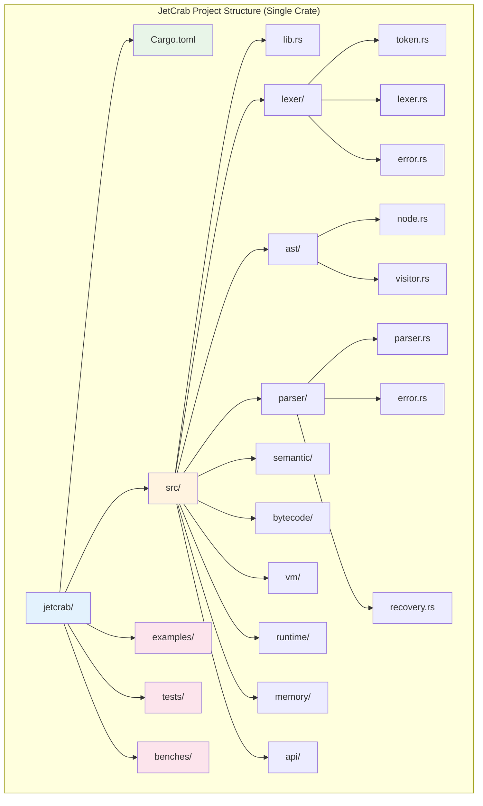
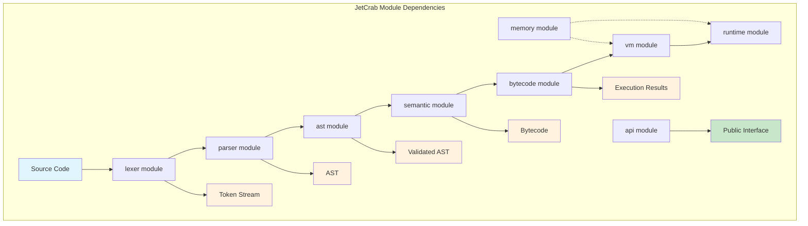

# JetCrab Module Architecture

## Overview

JetCrab is organized as a **single crate** with **modular components** (modules), each handling a specific aspect of JavaScript engine functionality. This document provides detailed information about each module's architecture, responsibilities, and interfaces.

## Project Structure

**Important**: JetCrab is a **single crate** (`jetcrab`) with multiple **modules**, not multiple crates.



## Module Dependencies



## Individual Module Architecture

### lexer module

**Purpose**: Converts JavaScript source code into tokens

#### Structure
```
src/lexer/
├── mod.rs          # Module declaration and public exports
├── token.rs        # Token definitions and metadata
├── lexer.rs        # Main lexer implementation
├── error.rs        # Lexer-specific error types
├── scanners/       # Token scanners for different token types
└── utils/          # Lexer utility functions
```

#### Key Components
- **Token**: Represents individual lexical units with position information
- **TokenKind**: Enumeration of all possible token types
- **Lexer**: Main tokenization engine
- **Scanners**: Specialized token scanners for different syntax elements

### ast module

**Purpose**: Defines the Abstract Syntax Tree structure

#### Structure
```
src/ast/
├── mod.rs          # Module declaration and public exports
├── node.rs         # Base AST node structure
├── visitor.rs      # Visitor pattern for AST traversal
├── common/         # Common AST utilities
├── expressions/    # Expression node types
├── literals/       # Literal value node types
└── statements/     # Statement node types
```

#### Key Components
- **Node**: Base trait for all AST nodes
- **Visitor**: Pattern for traversing and processing AST
- **Expressions**: Mathematical, logical, and function expressions
- **Statements**: Control flow and declaration statements

### parser module

**Purpose**: Converts tokens into AST

#### Structure
```
src/parser/
├── mod.rs          # Module declaration and public exports
├── core.rs         # Main parser implementation
├── error.rs        # Parser-specific error types
├── recovery.rs     # Error recovery strategies
├── expressions/    # Expression parsing logic
├── literals/       # Literal parsing logic
├── statements/     # Statement parsing logic
└── utils/          # Parser utility functions
```

#### Key Components
- **Parser**: Main parsing engine
- **Error Recovery**: Strategies for handling syntax errors
- **Expression Parsers**: Specialized parsers for different expression types
- **Statement Parsers**: Specialized parsers for different statement types

### semantic module

**Purpose**: Performs semantic analysis and validation

#### Structure
```
src/semantic/
├── mod.rs          # Module declaration and public exports
├── analyzer.rs     # Main semantic analyzer
├── scope.rs        # Scope management and symbol tables
├── types.rs        # Type system and type checking
└── errors.rs       # Semantic error types
```

#### Key Components
- **SemanticAnalyzer**: Main analysis engine
- **Scope**: Symbol table and scope management
- **Type System**: Type checking and validation
- **Error Reporting**: Semantic error collection and reporting

### bytecode module

**Purpose**: Generates bytecode from AST

#### Structure
```
src/bytecode/
├── mod.rs          # Module declaration and public exports
├── generator.rs    # Main bytecode generator
├── optimizer.rs    # Bytecode optimization passes
├── scope/          # Scope analysis for bytecode
├── expressions/    # Expression bytecode generation
├── literals/       # Literal bytecode generation
└── statements/     # Statement bytecode generation
```

#### Key Components
- **BytecodeGenerator**: Main generation engine
- **Optimizer**: Bytecode optimization passes
- **Scope Analysis**: Variable scope analysis for bytecode
- **Instruction Generation**: Specialized generators for different node types

### vm module

**Purpose**: Executes bytecode

#### Structure
```
src/vm/
├── mod.rs          # Module declaration and public exports
├── executor/       # Execution engine
├── heap/           # Memory heap management
├── types/          # VM value types
├── value.rs        # Value representation
├── frame.rs        # Execution frame management
├── stack.rs        # Execution stack
└── registers.rs    # Register management
```

#### Key Components
- **Executor**: Main execution engine
- **Heap**: Memory allocation and management
- **Value System**: Runtime value representation
- **Frame Management**: Execution context management

### runtime module

**Purpose**: Provides runtime environment and built-ins

#### Structure
```
src/runtime/
├── mod.rs          # Module declaration and public exports
├── context.rs      # Runtime execution context
├── builtins.rs     # Built-in functions and objects
├── function.rs     # Function execution
└── object.rs       # Object system
```

#### Key Components
- **Context**: Runtime execution context
- **Builtins**: Standard library functions and objects
- **Function**: Function execution engine
- **Object**: Object system and property access

### memory module

**Purpose**: Manages memory allocation and garbage collection

#### Structure
```
src/memory/
├── mod.rs          # Module declaration and public exports
├── heap.rs         # Memory heap implementation
├── allocator.rs    # Memory allocation strategies
├── collector.rs    # Garbage collection
└── error.rs        # Memory-related error types
```

#### Key Components
- **Heap**: Memory heap management
- **Allocator**: Memory allocation strategies
- **Collector**: Garbage collection algorithms
- **Error Handling**: Memory-related error management

### api module

**Purpose**: Public API and integration interface

#### Structure
```
src/api/
├── mod.rs          # Module declaration and public exports
├── engine.rs       # Main engine interface
├── compiler.rs     # Compilation interface
├── interpreter.rs  # Interpretation interface
├── config.rs       # Configuration system
├── debug.rs        # Debugging and profiling
├── events.rs       # Event system
├── modules.rs      # Module loading system
└── error.rs        # API error types
```

#### Key Components
- **Engine**: Main public interface
- **Compiler**: Compilation API
- **Configuration**: Engine configuration system
- **Debugging**: Debug and profiling tools

## Module Organization Principles

### 1. **Single Crate Design**
- All modules are part of one `jetcrab` crate
- No external crate dependencies for core functionality
- Unified compilation and testing

### 2. **Clear Module Boundaries**
- Each module has a specific responsibility
- Minimal coupling between modules
- Well-defined public interfaces

### 3. **Consistent Structure**
- Each module follows the same organizational pattern
- `mod.rs` for module declaration and exports
- Subdirectories for related functionality

### 4. **Dependency Management**
- Clear dependency flow: lexer → parser → ast → semantic → bytecode → vm
- Runtime and memory modules provide services to other modules
- API module aggregates all public interfaces

## Benefits of Module Architecture

### **Maintainability**
- Clear separation of concerns
- Easy to locate specific functionality
- Simplified testing and debugging

### **Extensibility**
- New features can be added as new modules
- Existing modules can be enhanced independently
- Plugin system can integrate with specific modules

### **Performance**
- Single crate compilation enables better optimization
- Shared memory and type systems
- Efficient inter-module communication

### **Development**
- Multiple developers can work on different modules
- Clear ownership and responsibility
- Easier code review and quality control

## Future Module Considerations

### **Potential Module Additions**
- **jit**: Just-in-time compilation module
- **wasm**: WebAssembly support module
- **network**: Network and HTTP support module
- **crypto**: Cryptographic operations module

### **Module Refactoring**
- **semantic**: May be split into type-checking and scope modules
- **vm**: May be split into execution and memory management modules
- **api**: May be split into public and internal API modules

---

**Note**: This architecture document reflects the current single-crate, multi-module design of JetCrab. The project uses Rust modules, not separate crates, for better integration and performance. 