# JetCrab: A Complete Guide for Beginners

## What is JetCrab?

JetCrab is a **JavaScript engine** written in Rust. Think of it as a program that can read, understand, and execute JavaScript code - just like how your web browser runs JavaScript, but as a standalone application.

## Why is this important?

JavaScript engines are fundamental to modern computing. They power:
- Web browsers (Chrome, Firefox, Safari)
- Node.js applications
- Mobile apps
- Server-side applications
- IoT devices

Understanding how they work gives you insight into the foundation of modern software development.

## Computer Science Theory Behind JetCrab

### 1. Compiler Theory

A JavaScript engine is essentially a **compiler** and **interpreter** combined. Here's the theory:

#### What is a Compiler?
A compiler is a program that translates code from one language to another. In JetCrab's case:
- **Input**: JavaScript source code (text)
- **Output**: Bytecode (machine-readable instructions)

#### The Compilation Pipeline
JetCrab follows the classic compiler pipeline:

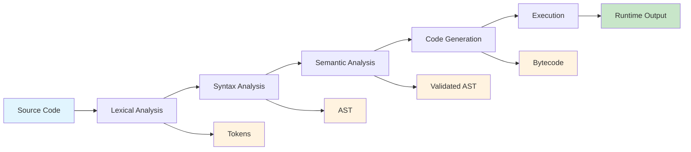

### 2. Lexical Analysis (Tokenization)

**Theory**: Lexical analysis breaks source code into meaningful units called "tokens."

**Real-world analogy**: Think of reading a sentence. You don't read it letter by letter - you read it word by word. Each word is a "token."

**In JetCrab**:
```javascript
let x = 5 + 3;
```
Becomes these tokens:
- `let` (keyword)
- `x` (identifier)
- `=` (operator)
- `5` (number literal)
- `+` (operator)
- `3` (number literal)
- `;` (punctuation)

**Computer Science Concept**: This is a **finite state machine** that recognizes patterns in text.

### 3. Syntax Analysis (Parsing)

**Theory**: Syntax analysis determines the structure and meaning of the program.

**Real-world analogy**: Just like grammar rules determine how words form sentences, parsing determines how tokens form valid JavaScript code.

**In JetCrab**:
The tokens are organized into an **Abstract Syntax Tree (AST)**:

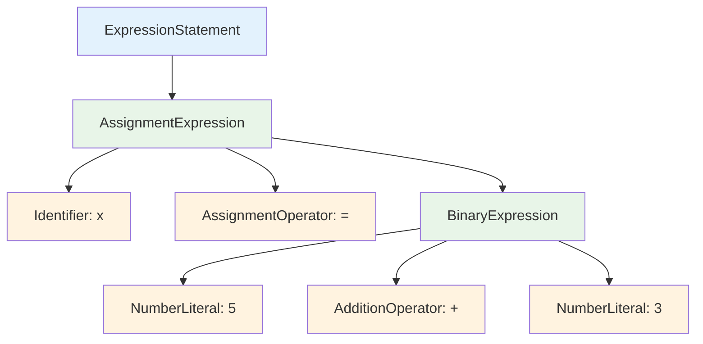

**Computer Science Concept**: This uses **context-free grammar** and **recursive descent parsing**.

### 4. Semantic Analysis

**Theory**: Semantic analysis checks if the program makes logical sense.

**Examples**:
- Are variables declared before use?
- Are function calls valid?
- Are types compatible?

**Computer Science Concept**: This involves **symbol tables** and **scope analysis**.

### 5. Code Generation

**Theory**: Code generation converts the AST into executable instructions.

**In JetCrab**: The AST is converted to **bytecode** - a low-level instruction set that the virtual machine can execute.

**Computer Science Concept**: This is **code generation** and **optimization**.

### 6. Virtual Machine Execution

**Theory**: A virtual machine is a program that simulates a computer.

**In JetCrab**: The VM reads bytecode instructions and executes them step by step.

**Computer Science Concept**: This is **interpretation** and **stack-based execution**.

## JetCrab Architecture Deep Dive

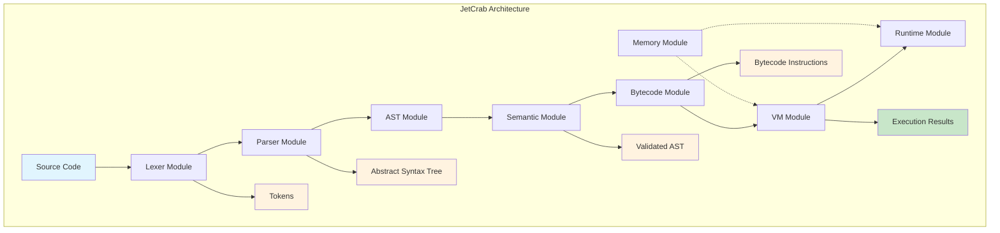

### 1. Lexer Module (`src/lexer/`)

**Purpose**: Converts JavaScript source code into tokens.

**Key Components**:
- **Token Recognition**: Identifies keywords, operators, literals
- **Position Tracking**: Keeps track of line/column numbers for error reporting
- **Error Recovery**: Continues parsing even when encountering errors

**Theory**: Uses **regular expressions** and **finite automata** to recognize token patterns.

### 2. Parser Module (`src/parser/`)

**Purpose**: Builds an Abstract Syntax Tree from tokens.

**Key Components**:
- **Expression Parsing**: Handles mathematical expressions, function calls
- **Statement Parsing**: Handles if statements, loops, variable declarations
- **Error Recovery**: Attempts to continue parsing after syntax errors

**Theory**: Implements **recursive descent parsing** with **operator precedence**.

### 3. AST Module (`src/ast/`)

**Purpose**: Represents the program structure in memory.

**Key Components**:
- **Node Types**: Different types for expressions, statements, declarations
- **Visitor Pattern**: Allows traversing the tree structure
- **Serialization**: Converts AST to JSON for debugging

**Theory**: Uses **tree data structures** and **design patterns**.

### 4. Semantic Module (`src/semantic/`)

**Purpose**: Validates program logic and meaning.

**Key Components**:
- **Scope Analysis**: Tracks variable declarations and usage
- **Type Checking**: Ensures operations are valid
- **Error Detection**: Finds logical errors in the code

**Theory**: Implements **symbol tables** and **type systems**.

### 5. Bytecode Module (`src/bytecode/`)

**Purpose**: Generates executable instructions from AST.

**Key Components**:
- **Instruction Set**: Low-level operations the VM can execute
- **Optimization**: Improves code efficiency
- **Constant Pool**: Stores repeated values efficiently

**Theory**: Uses **code generation** and **optimization techniques**.

### 6. VM Module (`src/vm/`)

**Purpose**: Executes bytecode instructions.

**Key Components**:
- **Stack Management**: Handles function calls and local variables
- **Register System**: Stores temporary values
- **Instruction Execution**: Processes bytecode one instruction at a time

**Theory**: Implements **stack-based virtual machines** and **register allocation**.

### 7. Runtime Module (`src/runtime/`)

**Purpose**: Provides JavaScript runtime environment.

**Key Components**:
- **Value System**: Handles different data types (numbers, strings, objects)
- **Object System**: Manages JavaScript objects and their properties
- **Built-in Functions**: Provides standard JavaScript functions

**Theory**: Implements **object-oriented programming** and **dynamic typing**.

### 8. Memory Module (`src/memory/`)

**Purpose**: Manages memory allocation and garbage collection.

**Key Components**:
- **Heap Management**: Allocates and frees memory
- **Garbage Collection**: Automatically cleans up unused memory
- **Memory Safety**: Prevents memory leaks and corruption

**Theory**: Uses **garbage collection algorithms** and **memory management**.

## How JetCrab Processes JavaScript Code

### Step-by-Step Example

Let's trace how JetCrab processes this simple JavaScript code:

```javascript
let x = 10;
let y = 20;
console.log(x + y);
```

#### Step 1: Lexical Analysis
The lexer converts this into tokens:
```
[let, x, =, 10, ;, let, y, =, 20, ;, console, ., log, (, x, +, y, ), ;]
```

#### Step 2: Syntax Analysis
The parser builds an AST:

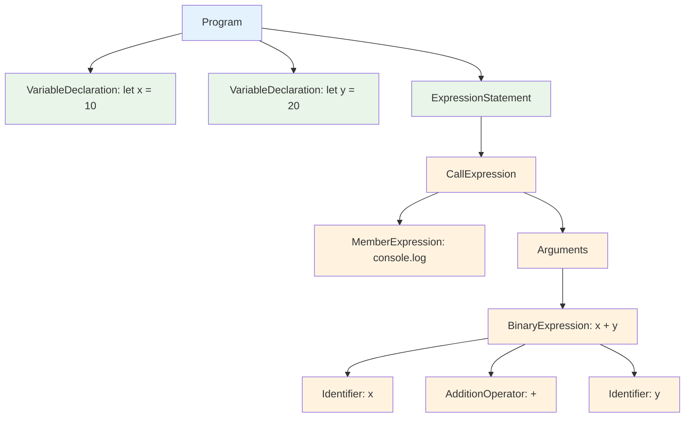

#### Step 3: Semantic Analysis
The semantic analyzer:
- Checks that `x` and `y` are declared before use
- Validates that `console.log` is a valid function
- Ensures the addition operation is valid

#### Step 4: Bytecode Generation
The bytecode generator creates instructions:

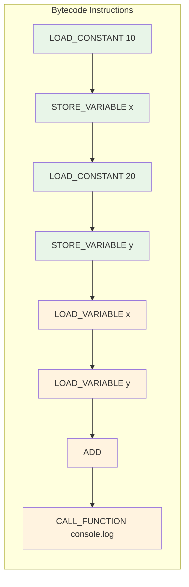

#### Step 5: Virtual Machine Execution
The VM executes each instruction:

```mermaid
graph TD
    subgraph "VM Execution Steps"
        A[1. Load 10 into memory] --> B[2. Store as variable x]
        B --> C[3. Load 20 into memory]
        C --> D[4. Store as variable y]
        D --> E[5. Load value of x (10)]
        E --> F[6. Load value of y (20)]
        F --> G[7. Add them together (30)]
        G --> H[8. Call console.log with result 30]
    end
    
    subgraph "Memory State"
        I[Variable x = 10]
        J[Variable y = 20]
        K[Stack: 30]
    end
    
    style A fill:#e8f5e8
    style B fill:#e8f5e8
    style C fill:#e8f5e8
    style D fill:#e8f5e8
    style E fill:#fff3e0
    style F fill:#fff3e0
    style G fill:#fff3e0
    style H fill:#fff3e0
    style I fill:#e1f5fe
    style J fill:#e1f5fe
    style K fill:#e1f5fe
```

#### Step 6: Runtime Output
The runtime environment outputs: `30`

## Key Computer Science Concepts in JetCrab

### 1. Data Structures

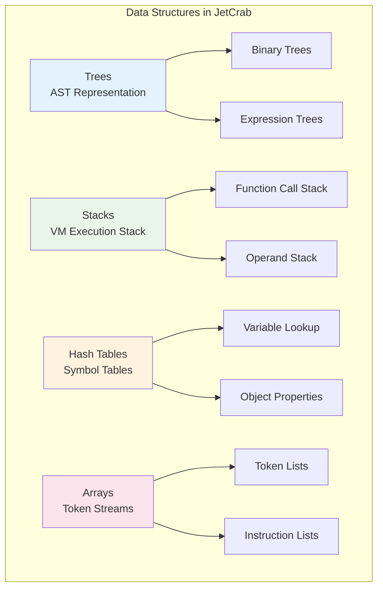

### 2. Algorithms

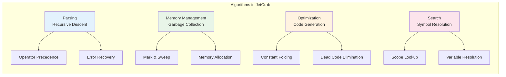

### 3. Theory of Computation

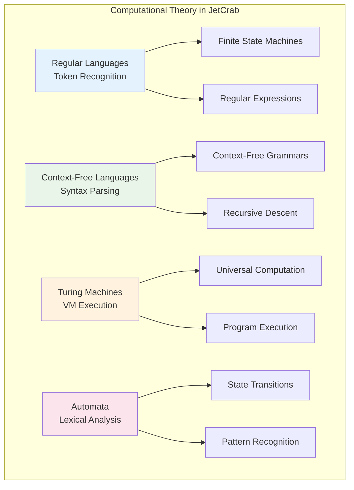

### 4. Programming Language Theory

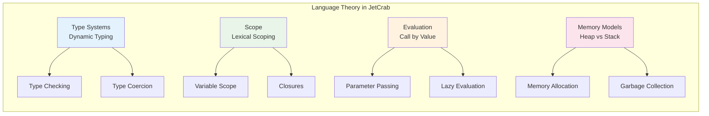

## Performance Considerations

### Why Rust?

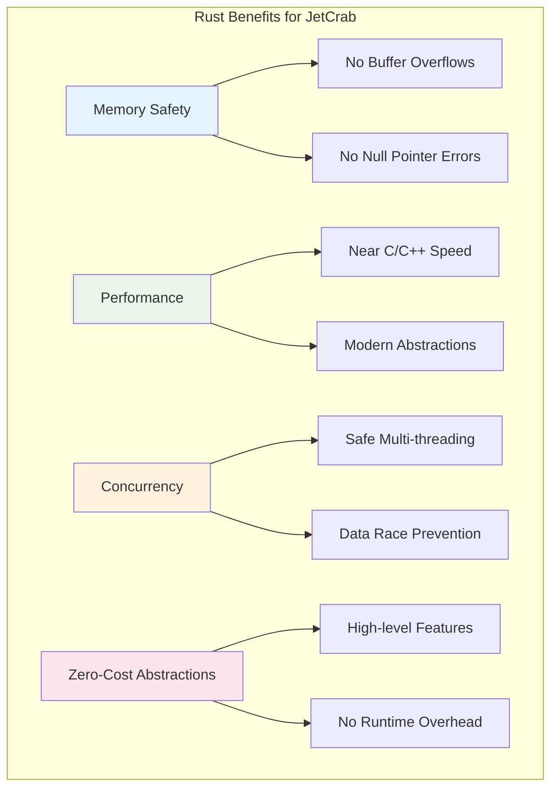

### Optimization Techniques

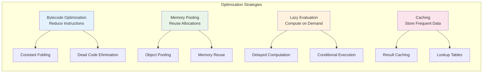

## Learning Path for Beginners

### 1. Start with the Basics

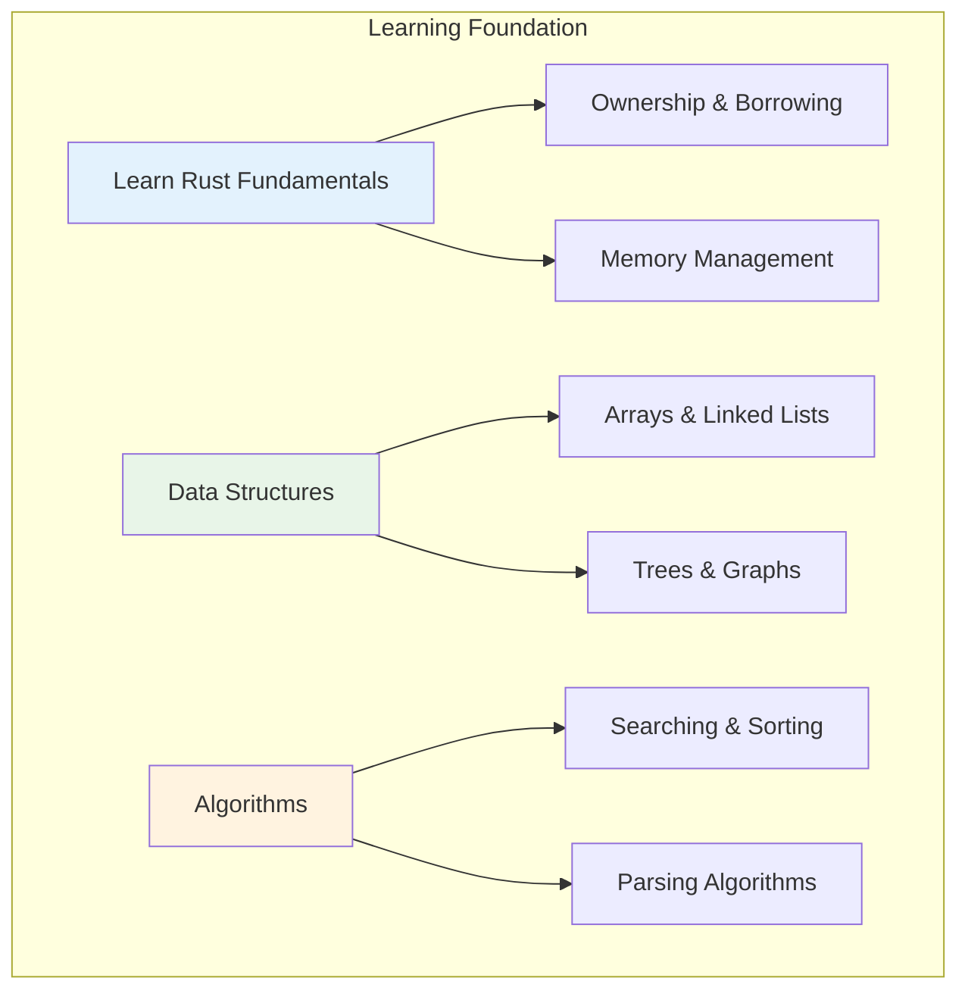

### 2. Study Compiler Theory

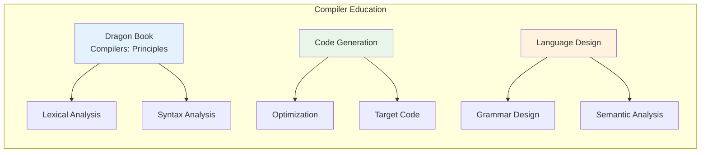

### 3. Explore JetCrab Code

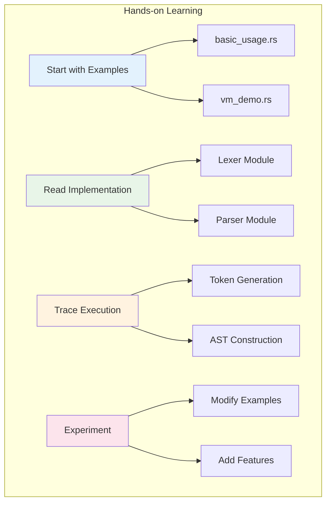

### 4. Build Your Own

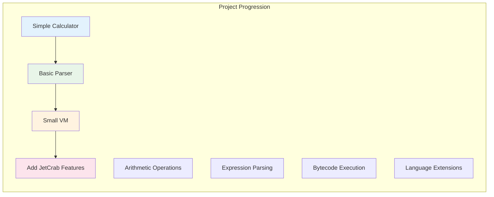

## Common Questions

### Q: Why not use an existing JavaScript engine?
A: Building from scratch teaches fundamental concepts and allows customization for specific use cases.

### Q: How does this compare to V8 or SpiderMonkey?
A: JetCrab is educational and experimental, while V8/SpiderMonkey are production engines with years of optimization.

### Q: Can I use JetCrab in production?
A: Currently, it's designed for learning and experimentation. Production use would require more testing and optimization.

### Q: How do I contribute to JetCrab?
A: Start by reading the code, running tests, fixing bugs, and adding small features. Check the CONTRIBUTING.md file.

## Conclusion

JetCrab is more than just a JavaScript engine - it's a comprehensive learning tool that demonstrates fundamental computer science concepts in practice. By understanding how JetCrab works, you'll gain deep insights into:

- How programming languages are designed
- How compilers and interpreters work
- How virtual machines execute code
- How memory management affects performance
- How to build large, complex software systems

This knowledge is valuable whether you're building web applications, system software, or learning about computer science fundamentals.

Remember: Every complex system is built from simple components. JetCrab shows how these components work together to create something powerful and useful. 