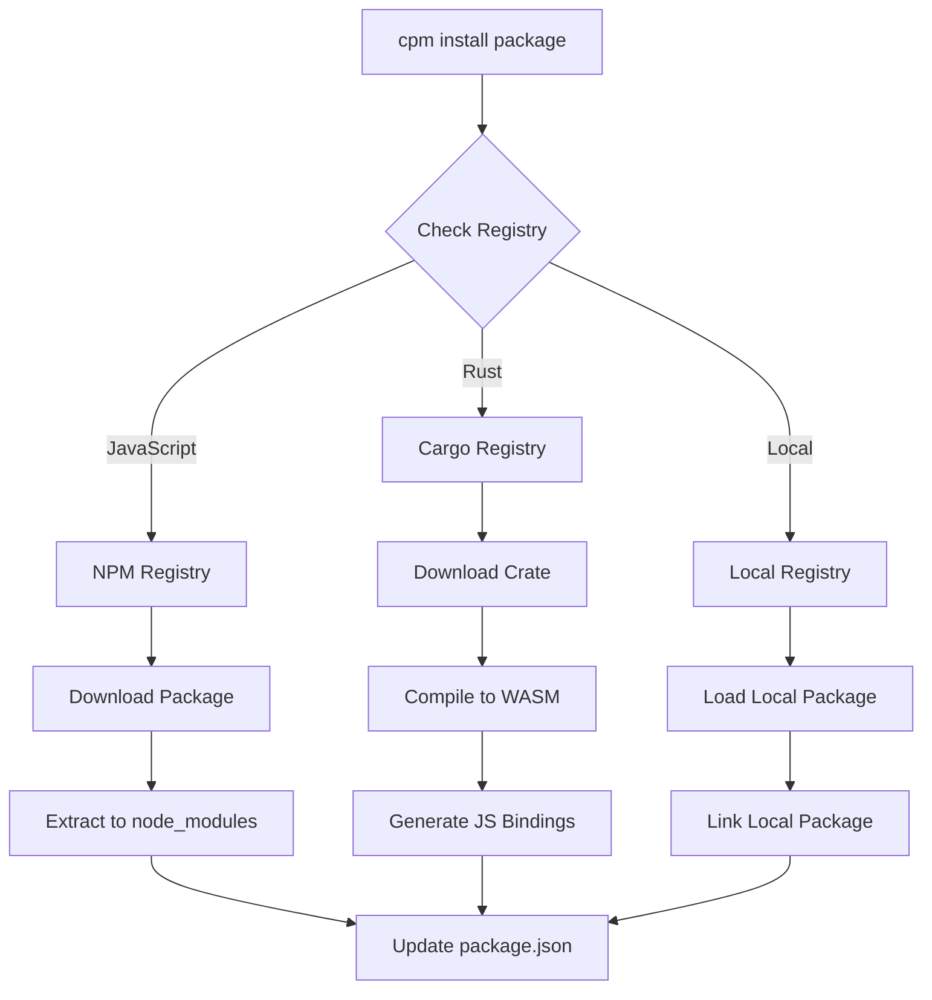
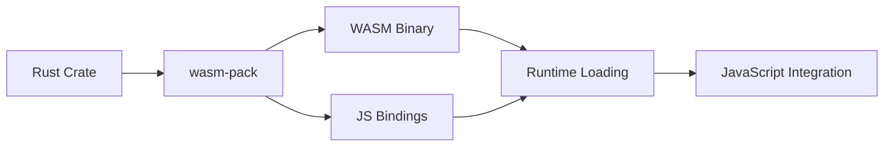

# CPM Package Manager

## Overview

CPM is the official package manager for JetCrab, providing unified dependency management for both JavaScript and Rust packages through WebAssembly integration. It serves as the package manager for JetCrab, similar to how npm serves Node.js.

## Features

- **Unified Package Management**: Install JavaScript and Rust packages seamlessly
- **WebAssembly Integration**: Automatic compilation of Rust code to WASM
- **Multi-Registry Support**: NPM, Cargo, and custom registries
- **Intelligent Caching**: Optimized caching system for fast builds
- **Development Tools**: Hot reload, linting, formatting, and testing
- **Workspace Support**: Multi-package project management

## Installation

CPM is included with JetCrab installation. If you have JetCrab installed, CPM is available as a separate binary:

```bash
# Verify CPM installation
cpm --version

# Expected output: CPM v0.4.0
```

## Quick Start

### Initialize a New Project
```bash
# Create a new project
cpm init my-project
cd my-project

# This creates:
# - package.json (package configuration)
# - src/ directory
# - Basic project structure
```

### Install Packages
```bash
# Install JavaScript packages
cpm install react lodash

# Install Rust crates
cpm install serde tokio

# Install both types
cpm install react serde
```

### Run Development Server
```bash
# Start development server with hot reload
cpm dev

# With file watching
cpm dev --watch
```

## Commands Reference

### Package Management
| Command | Description | Example |
|---------|-------------|---------|
| `cpm install [packages...]` | Install packages from registries | `cpm install react lodash` |
| `cpm build` | Build the project | `cpm build` |

### Project Management
| Command | Description | Example |
|---------|-------------|---------|
| `cpm init [name]` | Initialize a new project | `cpm init my-app` |
| `cpm build` | Build the project | `cpm build` |
| `cpm run [script]` | Run a project script | `cpm run start` |
| `cpm test` | Run project tests | `cpm test` |

### Development Tools
| Command | Description | Example |
|---------|-------------|---------|
| `cpm dev` | Start development server | `cpm dev` |
| `cpm lint` | Run code linting | `cpm lint --fix` |
| `cpm format` | Format code | `cpm format` |
| `cpm bundle` | Create production bundle | `cpm bundle` |

## Configuration

### Package Configuration (package.json)
```json
{
  "name": "my-project",
  "version": "0.4.0",
  "description": "My JetCrab project",
  "main": "src/index.js",
  "scripts": {
    "start": "jetcrab run src/index.js",
    "test": "jetcrab run tests/",
    "build": "cpm bundle"
  },
  "dependencies": {
    "react": "^18.0.0",
    "lodash": "^4.17.21"
  },
  "rust_dependencies": {
    "serde": "1.0",
    "tokio": "1.0"
  },
  "registries": {
    "npm": "https://registry.npmjs.org",
    "cargo": "https://crates.io"
  }
}
```

### Registry Configuration
```json
{
  "registries": {
    "npm": "https://registry.npmjs.org",
    "cargo": "https://crates.io",
    "local": "./packages"
  }
}
```

## Architecture

### Package Resolution Flow


### WebAssembly Integration


## Advanced Features

### Hybrid Packages
Packages that combine JavaScript and Rust:

```json
{
  "name": "my-hybrid-package",
  "version": "0.4.0",
  "main": "src/index.js",
  "wasm_entry": "src/lib.rs",
  "dependencies": {
    "lodash": "^4.17.21"
  },
  "rust_dependencies": {
    "serde": "1.0"
  }
}
```

### Custom Registries
```bash
# Add custom registry
# Registry management not yet implemented

# Install from custom registry
cpm install @my-registry/package
```

### Workspace Support
```json
{
  "workspaces": [
    "packages/*",
    "apps/*"
  ]
}
```

## Development Workflow

### 1. Project Setup
```bash
# Initialize project
cpm init my-project
cd my-project

# Install dependencies
cpm install react serde
```

### 2. Development
```bash
# Start development server
cpm dev

# In another terminal, run tests
cpm test

# Lint code
cpm lint
```

### 3. Building
```bash
# Create production bundle
cpm bundle

# Build optimized version
cargo build --release
```

## Performance Optimization

### Caching Strategy
- **Package Cache**: Downloaded packages cached locally
- **Build Cache**: Compilation results cached
- **Dependency Cache**: Dependency trees cached
- **Registry Cache**: Registry responses cached

### Build Performance
- Parallel dependency resolution
- Incremental compilation
- Intelligent caching
- Optimized WebAssembly generation

## Security Features

### Package Verification
- Package integrity checking
- Digital signature verification
- Dependency vulnerability scanning
- Secure registry communication

### Sandboxing
- Isolated package execution
- Resource limits
- Network access control
- File system restrictions

## Troubleshooting

### Common Issues

#### Package Installation Fails
```bash
# Clear cache and retry
cpm cache clear
cpm install [package]
```

#### WebAssembly Compilation Errors
```bash
# Check Rust toolchain
rustup show

# Update wasm-pack
cargo install wasm-pack --force
```

#### Registry Connection Issues
```bash
# Check registry configuration
# Registry commands not yet implemented

# Test connectivity
# Registry commands not yet implemented
```

### Debug Mode
```bash
# Enable verbose logging
cpm --verbose install [package]

# Debug specific command
RUST_LOG=debug cpm install react
```

## Best Practices

### 1. Project Organization
```
my-project/
├── src/
│   ├── index.js          # Main entry point
│   └── lib.rs           # Rust library (optional)
├── tests/
│   └── test.js          # Test files
├── package.json            # Package configuration
└── README.md            # Project documentation
```

### 2. Dependency Management
- Use exact versions for production dependencies
- Keep development dependencies separate
- Regularly update dependencies
- Use lock files for reproducible builds

### 3. Performance
- Leverage caching for faster builds
- Use incremental compilation
- Optimize WebAssembly bundle size
- Profile build performance regularly

## Integration with JetCrab

### Runtime Integration
```javascript
// CPM automatically configures JetCrab runtime
// No additional setup required

// JavaScript code can import packages
import { debounce } from 'lodash';
import { add } from './pkg/my_rust_lib.js';

console.log(debounce(() => console.log('Hello'), 100));
console.log(add(2, 3));
```

### Development Integration
```bash
# CPM validates JetCrab installation
cpm install react  # Automatically checks JetCrab

# Skip validation if needed
cpm --skip-jetcrab-check install react
```

## Examples

### Basic JavaScript Project
```bash
# Initialize project
cpm init js-project
cd js-project

# Install dependencies
cpm install lodash axios

# Create main file
echo "import _ from 'lodash'; console.log(_.chunk([1,2,3,4], 2));" > src/index.js

# Run project
cpm run start
```

### Hybrid JavaScript + Rust Project
```bash
# Initialize project
cpm init hybrid-project
cd hybrid-project

# Install both JS and Rust dependencies
cpm install react serde

# Create Rust library
echo 'use serde::{Serialize, Deserialize}; #[derive(Serialize, Deserialize)] pub struct User { pub name: String, pub age: u32 }' > src/lib.rs

# Create JavaScript entry
echo "import { User } from './pkg/hybrid_project.js'; const user = new User('Alice', 30); console.log(user);" > src/index.js

# Run project
cpm run start
```

## Resources

- **Documentation**: [docs/](../README.md)
- **Examples**: [examples/](../../examples/)
- **GitHub Repository**: [JetCrab](https://github.com/JetCrabCollab/JetCrab)
- **Issues**: [GitHub Issues](https://github.com/JetCrabCollab/JetCrab/issues)
- **Discussions**: [GitHub Discussions](https://github.com/JetCrabCollab/JetCrab/discussions)

---

**CPM v0.4.0** - Modern Package Manager for JetCrab
