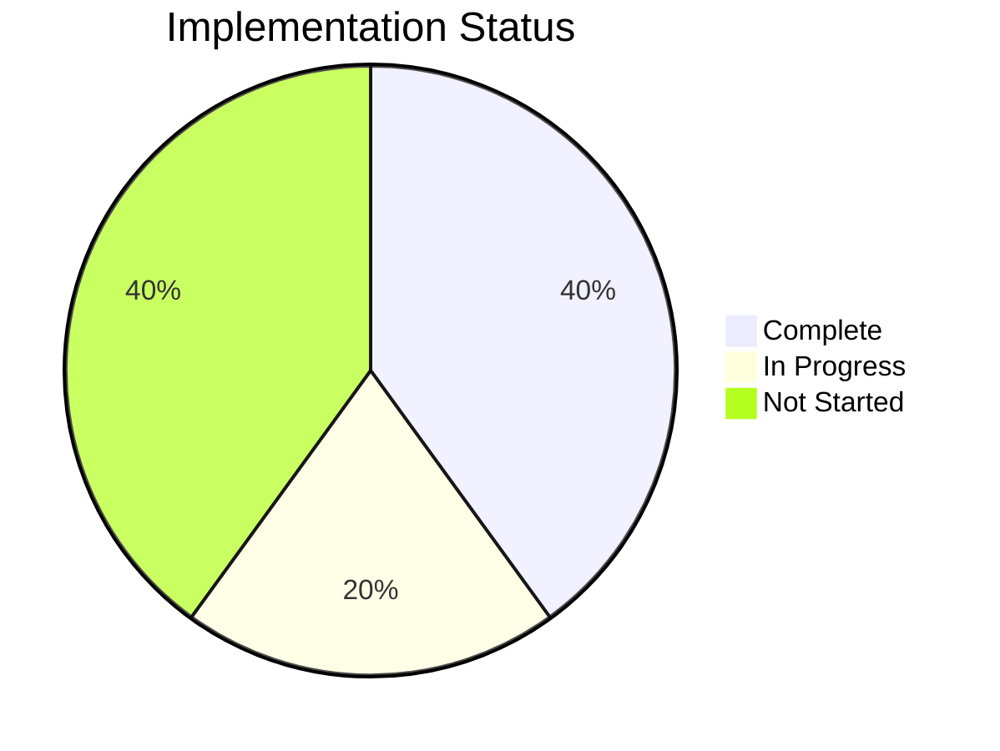

# Implementation Status

This directory contains detailed information about the current implementation status of JetCrab components.

## Overview

JetCrab is organized as a single crate with modular components. This section tracks the implementation progress of each component and provides detailed checklists for development.

## Current Status

- **Core Components**: Basic structure implemented
- **Compilation Status**: Multiple errors need fixing
- **Test Coverage**: Needs significant updates
- **API Stability**: Inconsistent across modules

## Implementation Checklists

### **Main Checklist**
- **[Main Checklist](./main-checklist.md)** - Overall project status and milestones
- **[ECMAScript Compliance](./ecmascript-compliance.md)** - Feature compliance status

### **Component-Specific**
- **[VM Checklist](./vm-checklist.md)** - Virtual Machine implementation progress
- **[GC Checklist](./gc-checklist.md)** - Garbage Collection implementation status
- **[JIT Checklist](./jit-implementation-checklist.md)** - JIT compiler implementation
- **[Crates Checklist](./crates-master-checklist.md)** - Crate organization status

## Component Status

### **Completed Components**
- **Lexer**: 100% complete - Tokenization and lexical analysis
- **AST**: 100% complete - Abstract Syntax Tree representation
- **Parser**: 100% complete - Syntax analysis and AST construction
- **Semantic Analysis**: 100% complete - Type checking and scope management
- **Bytecode Generation**: 100% complete - Code generation and optimization

### **In Progress**
- **Virtual Machine**: Phases 1-3 complete, Phase 4 in progress
- **Memory Management**: Basic implementation, needs fixes
- **Runtime Environment**: Basic structure, API inconsistencies

### **Not Started**
- **JIT Compiler**: Planning phase
- **Garbage Collection**: Advanced features
- **API Integration**: Public API layer
- **Performance Optimizations**: Advanced optimizations

## Next Steps

1. **Fix Compilation Errors** - Resolve 377+ compilation errors
2. **Update Test Suite** - Align tests with current API
3. **Stabilize APIs** - Ensure consistency across modules
4. **Complete VM Implementation** - Finish Phase 4 and beyond
5. **Integration Testing** - End-to-end testing

## Development Guidelines

- Check individual component checklists for detailed requirements
- Update status as implementation progresses
- Maintain consistency with architecture documentation
- Regular updates with codebase changes

## Related Documentation

- **[Architecture Overview](../architecture/engine-overview.md)** - System design
- **[Development Guides](../development/)** - Contribution guidelines
- **[API Documentation](../api/)** - Integration details 