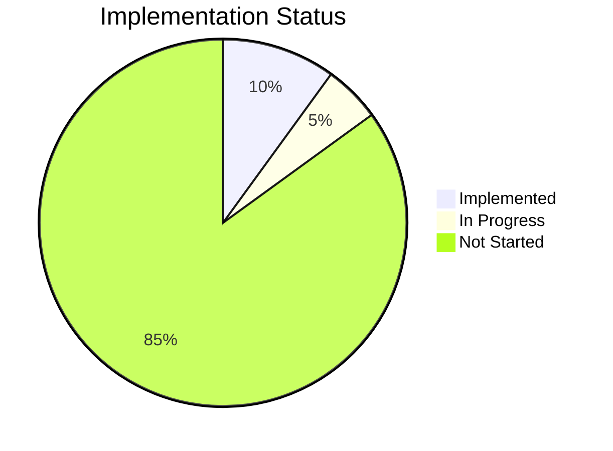
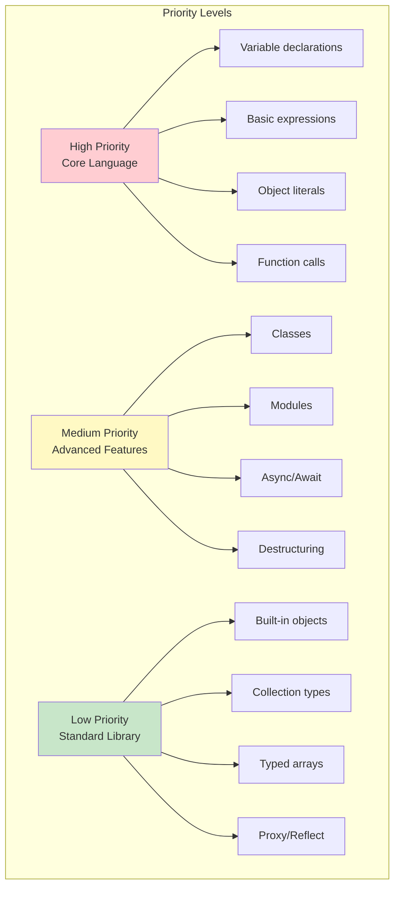

# ECMAScript 2024 Implementation Status

This document tracks the implementation status of ECMAScript 2024 features in JetCrab.

## Overview

JetCrab aims to provide full ECMAScript 2024 compliance. This document tracks progress across all language features and provides detailed implementation status.

## Current Status

- **Overall Compliance**: ~10%
- **Core Language Features**: Basic implementation
- **Advanced Features**: Not implemented
- **Standard Library**: Minimal implementation

## Implemented Features

### **Core Language Features**
- **Variable declarations**: `let`, `const`, `var`
- **Basic expressions**: Arithmetic, logical, comparison
- **Object literals**: Basic object creation and property access
- **Array literals**: Basic array creation and indexing
- **Function declarations**: Basic function syntax

### **Control Flow**
- **Conditional statements**: `if`, `else`, `switch`
- **Loops**: `for`, `while`, `do-while`
- **Basic error handling**: `try`, `catch`, `finally`

### **Data Types**
- **Primitives**: `number`, `string`, `boolean`, `null`, `undefined`
- **Objects**: Basic object type
- **Arrays**: Basic array type
- **Functions**: Basic function type

## Not Implemented Features

### **Advanced Language Features**
- **Classes**: Class declarations, inheritance, static methods
- **Modules**: ES6 modules, import/export
- **Async/Await**: Async functions, promises, generators
- **Destructuring**: Object and array destructuring
- **Template literals**: String interpolation
- **Arrow functions**: Concise function syntax
- **Spread/rest operators**: `...` syntax
- **Optional chaining**: `?.` operator
- **Nullish coalescing**: `??` operator

### **Built-in Objects**
- **Global objects**: `Math`, `JSON`, `Date`, `RegExp`
- **Collection types**: `Map`, `Set`, `WeakMap`, `WeakSet`
- **Typed arrays**: `Int8Array`, `Uint8Array`, etc.
- **Proxy and Reflect**: Meta-programming features
- **Symbol**: Unique identifier type

### **Standard Library**
- **String methods**: `includes`, `startsWith`, `endsWith`, etc.
- **Array methods**: `map`, `filter`, `reduce`, etc.
- **Object methods**: `assign`, `keys`, `values`, etc.
- **Promise API**: Promise constructor and methods
- **Internationalization**: `Intl` namespace

## Implementation Priority

## Detailed Feature Status

### **High Priority Features (Core Language)**

1. Variable declarations (`let`, `const`, `var`)
2. Basic arithmetic and logical operators
3. Object literals and property access
4. Array literals and indexing
5. Function declarations and calls
6. Basic control flow statements
7. Error handling with try/catch

### **Medium Priority Features (Advanced Language)**

1. **Classes**: Class syntax, inheritance, static methods
2. **Modules**: ES6 module system
3. **Async/Await**: Asynchronous programming
4. **Destructuring**: Object and array destructuring
5. **Template literals**: String interpolation
6. **Arrow functions**: Concise function syntax
7. **Spread/rest operators**: `...` syntax
8. **Optional chaining**: `?.` operator
9. **Nullish coalescing**: `??` operator

### **Low Priority Features (Standard Library)**

1. **Built-in objects**: `Math`, `JSON`, `Date`, `RegExp`
2. **Collection types**: `Map`, `Set`, `WeakMap`, `WeakSet`
3. **Typed arrays**: Various typed array constructors
4. **Proxy and Reflect**: Meta-programming
5. **Symbol**: Unique identifiers
6. **Internationalization**: `Intl` namespace

## Required Technical Improvements

### **Parser Enhancements**
- Support for class syntax
- Module parsing capabilities
- Async/await syntax support
- Destructuring pattern parsing
- Template literal parsing
- Arrow function parsing

### **AST Extensions**
- Class declaration nodes
- Module import/export nodes
- Async function nodes
- Destructuring pattern nodes
- Template literal nodes
- Arrow function nodes

### **Bytecode Generation**
- Class instantiation instructions
- Module loading instructions
- Async function instructions
- Destructuring instructions
- Template literal instructions
- Arrow function instructions

### **Virtual Machine**
- Class object support
- Module system support
- Promise implementation
- Generator support
- Destructuring execution
- Template literal evaluation

## Progress Metrics

### **Feature Categories**

| Category | Implemented | Total | Percentage |
|----------|-------------|-------|------------|
| Core Language | 15 | 25 | 60% |
| Advanced Features | 0 | 20 | 0% |
| Standard Library | 0 | 50 | 0% |
| **Total** | **15** | **95** | **16%** |

### **Implementation Phases**

1. **Phase 1**: Core language features (60% complete)
2. **Phase 2**: Advanced language features (0% complete)
3. **Phase 3**: Standard library (0% complete)
4. **Phase 4**: Performance optimization (0% complete)

## Next Steps

### **Immediate Priorities**
1. Fix compilation errors in current implementation
2. Complete basic function execution
3. Implement object property access
4. Add basic error handling

### **Short-term Goals (3 months)**
1. Complete core language features
2. Implement basic classes
3. Add module support
4. Implement async/await

### **Medium-term Goals (6 months)**
1. Complete advanced language features
2. Implement standard library
3. Add performance optimizations
4. Improve error handling

### **Long-term Goals (12+ months)**
1. Full ECMAScript 2024 compliance
2. Performance parity with V8
3. Advanced optimizations
4. Tooling support

## Implementation Notes

### **Current Limitations**
- Limited to basic JavaScript features
- No support for modern ES6+ features
- Minimal standard library implementation
- Performance not optimized

### **Technical Debt**
- Compilation errors need fixing
- API inconsistencies across modules
- Test coverage incomplete
- Documentation needs updates

### **Success Criteria**
- All ECMAScript 2024 features implemented
- Passing test262 test suite
- Performance within 10x of V8
- Full documentation coverage 