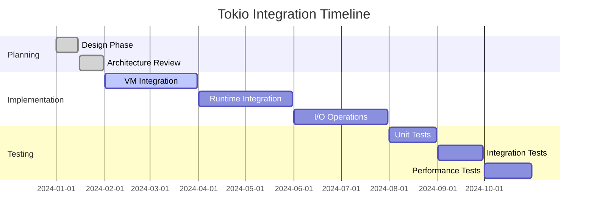
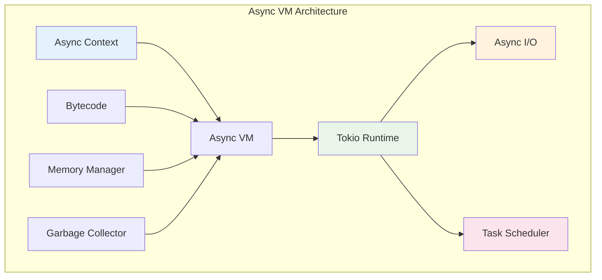

# Tokio Integration Task

## Overview

This document outlines the plan for integrating Tokio asynchronous runtime into JetCrab to improve performance, responsiveness, and scalability.

## Background

JetCrab currently uses a synchronous execution model. Integrating Tokio will enable:
- Asynchronous I/O operations
- Concurrent execution of multiple JavaScript contexts
- Better resource utilization
- Improved responsiveness for I/O-bound operations

## Objectives

1. **Performance Improvement**: Enable concurrent execution of multiple JavaScript contexts
2. **I/O Optimization**: Asynchronous file system and network operations
3. **Resource Management**: Better CPU and memory utilization
4. **Scalability**: Support for high-concurrency scenarios
5. **Modern Architecture**: Align with Rust's async ecosystem

## Current Status

- **Phase**: Planning and Design
- **Progress**: 20% complete
- **Next Milestone**: VM integration design
- **Estimated Completion**: Q4 2024

## Prerequisites

### **Technical Requirements**
- Rust 1.70+ with async/await support
- Tokio runtime (latest stable version)
- Async-compatible dependencies
- Performance benchmarking tools

### **Architecture Changes**
- VM execution model updates
- Memory management for async contexts
- Error handling for async operations
- Integration with existing bytecode system

### **Testing Infrastructure**
- Async test framework
- Performance benchmarking suite
- Concurrency testing tools
- Memory leak detection

## Implementation Plan

### **Phase 1: VM + Runtime (HIGH PRIORITY)**

#### **1.1 Async VM Architecture**
- Design async-compatible VM execution model
- Implement async instruction dispatch
- Add async context management
- Update memory management for async operations

#### **1.2 Runtime Integration**
- Integrate Tokio runtime with JetCrab
- Implement async execution contexts
- Add async error handling
- Update garbage collection for async scenarios

#### **1.3 Basic Async Operations**
- Implement async function calls
- Add async loop support
- Support async/await syntax
- Basic async I/O operations

### **Phase 2: I/O Operations (MEDIUM PRIORITY)**

#### **2.1 File System Operations**
- Async file reading and writing
- Directory operations
- File system watching
- Stream-based file processing

#### **2.2 Network Operations**
- HTTP client/server support
- WebSocket implementation
- TCP/UDP networking
- DNS resolution

#### **2.3 Stream Processing**
- Async iterators
- Stream transformations
- Backpressure handling
- Memory-efficient streaming

### **Phase 3: Advanced Features (LOW PRIORITY)**

#### **3.1 Concurrency Control**
- Worker thread pools
- Task scheduling
- Resource sharing
- Deadlock prevention

#### **3.2 Performance Optimization**
- Async JIT compilation
- Memory pooling
- Cache optimization
- Load balancing

#### **3.3 Monitoring and Debugging**
- Async stack traces
- Performance profiling
- Memory usage tracking
- Debug tools integration

### **Phase 4: Asynchronous Profiling (LOW PRIORITY)**

#### **4.1 Performance Monitoring**
- Async operation profiling
- Memory usage tracking
- CPU utilization monitoring
- I/O performance metrics

#### **4.2 Debugging Tools**
- Async stack trace support
- Breakpoint management
- Variable inspection
- Performance analysis tools

### **Phase 5: Integration and Testing**

#### **5.1 Comprehensive Testing**
- Unit tests for async operations
- Integration tests for I/O
- Performance benchmarks
- Stress testing

#### **5.2 Documentation**
- Async API documentation
- Performance guidelines
- Migration guide
- Best practices

## Technical Architecture

### **Async VM Design**

### **Execution Model**

1. **Async Context Creation**: Each JavaScript context runs in its own async task
2. **Bytecode Execution**: VM executes bytecode asynchronously
3. **I/O Operations**: Non-blocking I/O operations using Tokio
4. **Memory Management**: Async-aware garbage collection
5. **Error Handling**: Async error propagation and recovery

### **Memory Management**

- **Async Contexts**: Each async context has its own memory space
- **Shared Resources**: Thread-safe sharing of common resources
- **Garbage Collection**: Async-aware GC that doesn't block execution
- **Memory Pooling**: Efficient memory allocation for async operations

## Success Metrics

### **Performance Improvements**
- **Concurrency**: Support for 1000+ concurrent JavaScript contexts
- **I/O Performance**: 10x improvement in I/O-bound operations
- **Memory Usage**: Efficient memory utilization in async scenarios
- **Response Time**: Sub-millisecond response times for async operations

### **Scalability Metrics**
- **Throughput**: Handle 10,000+ operations per second
- **Resource Utilization**: 90%+ CPU utilization under load
- **Memory Efficiency**: <100MB memory per 1000 contexts
- **Error Rate**: <0.1% error rate under stress

### **Compatibility**
- **ECMAScript Compliance**: Maintain full ECMAScript compliance
- **API Compatibility**: Backward compatibility with sync API
- **Migration Path**: Smooth migration from sync to async
- **Tooling Support**: Full debugging and profiling support

## Risks and Mitigation

### **Technical Risks**
- **Complexity**: Async VM design complexity
- **Performance**: Overhead of async operations
- **Memory**: Memory leaks in async contexts
- **Debugging**: Difficulty debugging async code

### **Mitigation Strategies**
- **Incremental Implementation**: Phase-by-phase rollout
- **Performance Testing**: Continuous performance monitoring
- **Memory Profiling**: Regular memory leak detection
- **Comprehensive Testing**: Extensive test coverage

## Completion Checklist

### **Phase 1: VM Integration**
- [ ] Design async VM architecture
- [ ] Implement async instruction dispatch
- [ ] Add async context management
- [ ] Update memory management
- [ ] Basic async operations working

### **Phase 2: I/O Operations**
- [ ] File system operations
- [ ] Network operations
- [ ] Stream processing
- [ ] I/O performance optimization

### **Phase 3: Advanced Features**
- [ ] Concurrency control
- [ ] Performance optimization
- [ ] Monitoring and debugging
- [ ] Advanced async features

### **Phase 4: Testing and Documentation**
- [ ] Comprehensive testing
- [ ] Performance benchmarks
- [ ] Documentation updates
- [ ] Migration guide

### **Final Validation**
- [ ] All tests passing
- [ ] Performance targets met
- [ ] Documentation complete
- [ ] Ready for production use 